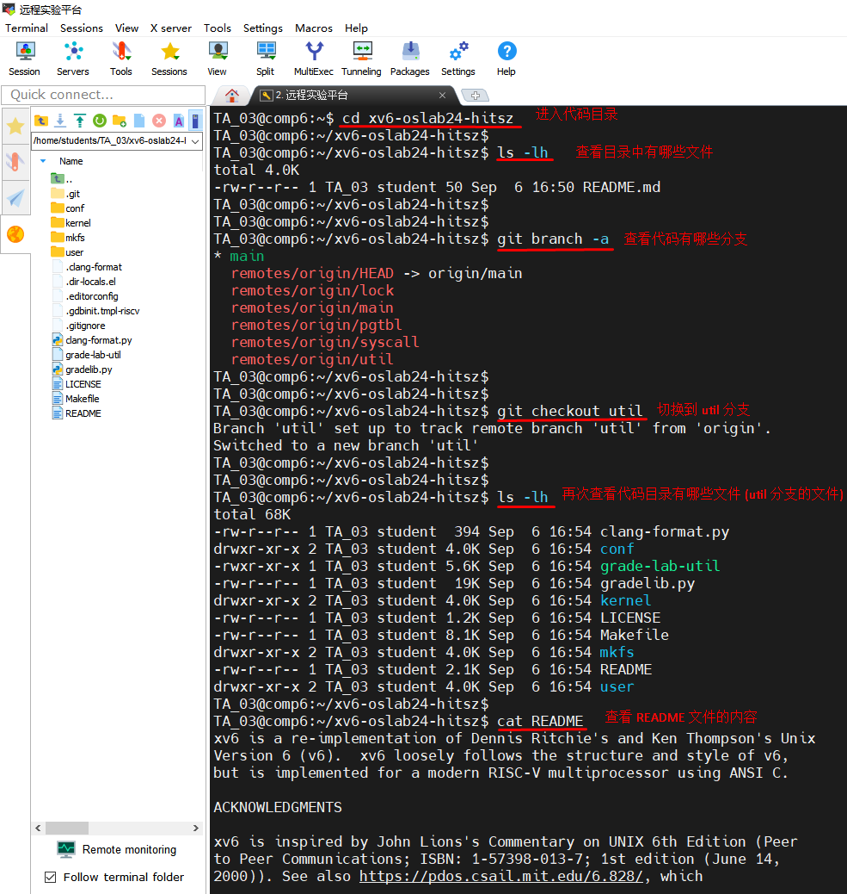

# 远程实验环境的使用/下载XV6代码

​	由于操作系统实验需要配置非常复杂的环境，并且很多时候配置和硬件设备相互依赖，不同的硬件设备要求的配置不一样。为了简化同学们操作系统实验的复杂度，我们提供远程实验环境。大家不需要自己配置环境，只需要远程登录到实验环境就可以做实验了，让大家专注于操作系统本身的代码逻辑，无需花大量时间在配置环境上。


## 一、远程实验环境说明


[看这里：远程实验环境详细说明](https://os-labs.pages.dev/)

```bash
远程实验环境为 Linux 系统，需要通过远程SSH方式登录到 Linux 服务器去操作

注意：你只能在校园网内才能访问服务器，如果你是在家里或者挂手机流量，那你无法访问服务器

SSH服务器IP：10.249.12.98  端口：6666

用户名：你的学号
密 码：你的学号

```


## 二、登录远程服务器

登录远程 Linux 服务器需要采用专门的软件来操作  [点这里：下载MobaXTerm软件](../Software/MobaXterm_24.2.7z)

**注意：这个教程使用的版本是 24.2 ，如果你用的版本和我们不一样，有可能一些操作会不一样，你需要自己解决不同版本的差异问题**


1. 下载 MobaXTerm 软件，解压缩，如下：

   

2. 启动 MobaXTerm 软件

   

3. 连接远程服务器

   

4. 输入账号、密码

   ```
   注意：你只能在校园网内才能访问服务器，如果你是在家里或者挂手机流量，那你无法访问服务器
   
   用户名：你的学号
   密 码：你的学号
   
   ```

   

5. 登录之后界面

   

6. 上传文件到服务器，从服务器下载文件

   > [!NOTE]
   >
   > **自己选择你电脑上随便一个文件，上传到服务器上试试**

   

   

7. 执行命令，查看服务器上的文件

   > [!NOTE]
   >
   > 注意：上一步你必须自己上传了一些文件，这一步你执行命令才能看到文件

   ```bash
   # 在远程Linux系统中，输入下面命令，你就可以看到刚才自己上传的文件
   
   ls -lh
   
   ```

   

   

   


## 三、下载XV6代码

XV6代码采用 Git 进行管理，如果你对 Git 不熟悉，请看这个教程快速入门：[Git快速入门教程](https://www.bilibili.com/video/BV1HM411377j)

```bash
# 输入下面命令，下载 XV6 代码到实验服务器上

git clone https://gitee.com/ftutorials/xv6-oslab24-hitsz.git

# 查看代码是否下载成功

ls -lh

```


## 四、查看XV6代码


[点这里查看：实验中心文档](https://os-labs.pages.dev/lab1/part3/)


```bash
# 进入代码目录，查看文件
cd xv6-oslab24-hitsz

# 查看目录，你会发现里面只有一个 Readme.md 文件
ls -lh

# 代码采用 git 管理，git 里面有多个分支 branch ，查看代码的分支
git branch -a

# 切换到 util 分支
git checkout util

# 再次查看目录，你就可以看到很多代码文件了
ls -lh

# 看其中一个文件的内容
cat README

# 到这里，你已经成功下载了 XV6 代码，并且会查看文件了
# 但是这种方式查看文件并不友好，我们需要更好的工具来查看文件
# 下一章节，我们会介绍用更好的软件查看文件
```

