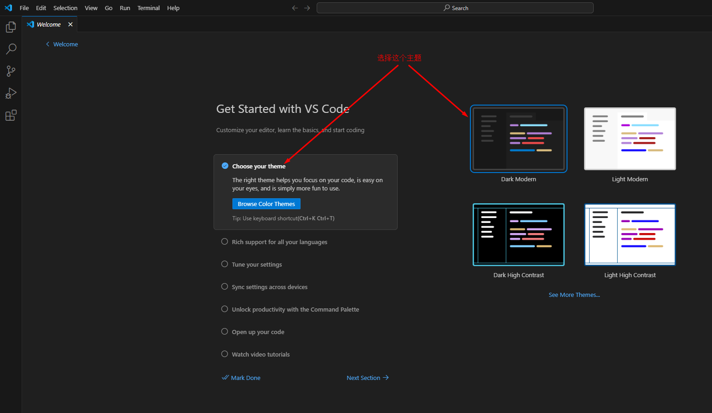

# Visual Studio Code 查看远程 XV6 代码


上一章中我们把XV6的代码下载到了远程服务器上。在远程服务器上用Linux命令查看代码文件不方便，我们使用更方便的工具 Visual Studio Code 来查看编辑代码。


[实验平台教程：远程 Visual Studio Code 使用](https://os-labs.pages.dev/remote_env/)


## 一、安装 Visual Studio Code 


**注意：这个教程使用的版本是 1.93.0 ，如果你用的版本和我们不一样，有可能一些操作会不一样，你需要自己解决不同版本的差异问题**

[点击这里从官网下载软件（版本 1.93.0）](https://code.visualstudio.com/download)

我们下载的是 zip 版，解压缩软件，运行下面程序启动 Visual Studio Code 





## 二、安装远程 SSH 插件


 我们的代码是放在远程服务器上的，所以需要给 Visual Studio Code 安装远程SSH插件才能访问远程服务器。


1. 打开插件安装面板

   

   

2. 安装插件 Remote SSH

   

   

4. 配置远程环境服务器

   ```
   远程实验环境为 Linux 系统，需要通过远程SSH方式登录到 Linux 服务器去操作
   
   注意：你只能在校园网内才能访问服务器，如果你是在家里或者挂手机流量，那你无法访问服务器
   
   SSH服务器IP：10.249.12.98  端口：6666
   
   用户名：你的学号
   密 码：你的学号
   
   ```

   

   ```
   # Read more about SSH config files: https://linux.die.net/man/5/ssh_config
   Host XV6
       HostName 10.249.12.98
       User 20XXXXXXX                         
       Port 6666
       
   ```

   

   ```
   # 99.99999% 的同学，用上面配置就可以了
   
   # 0.000001% 的同学，如果你的需要使用 HTTP 代理，这是一个配置HTTP代理的例子
   # Read more about SSH config files: https://linux.die.net/man/5/ssh_config
   Host XV6
       HostName 10.249.12.98
       User 20XXXXXXX
       Port 6666
       ProxyCommand D:\\Runtime\\PortableGit\\mingw64\\bin\\connect.exe -H hitvpn.lan:2081 %h %p
   ```

   

   ## 三、 连接远程 SSH 服务器

​	上面的配置成功之后，我们接下来需要连接远程服务器。注意看下面图片，一步一步操作。


## 四、 在 Terminal 中运行 Linux 命令


在 Visual Studio Code 中，也集成了一个命令行工具 Terminal，功能和 MobaXTerm 一样可以运行 Linux 命令。**至于是用 MobaXTerm 还是用这个 Terminal ，就随你喜欢了。**

打开终端 Terminal ，如下图：


## 五、 查看远程 XV6 代码


上一章中，我们用 git 已经下载了 XV6 的代码，现在我们用 Visual Studio Code 来打开代码，这样查看代码比较方便。


## 六、 远程 XV6 代码操作


后面所有的实验主要就是 2个 操作：

1. **编辑修改代码**：在 Visual Studio Code 中操作

2. **运行Linux命令**：在 Terminal 中运行，或者在 MobaXTerm 中运行（两个是一样的，随你喜欢用哪个）

   


