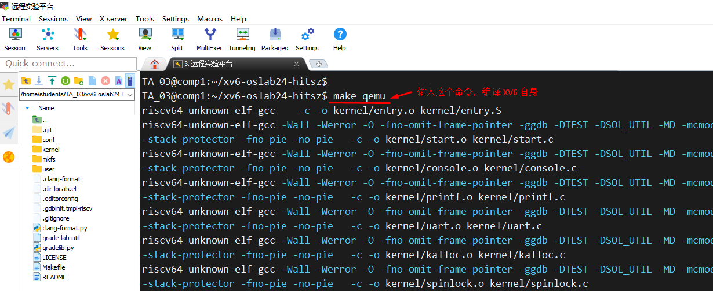
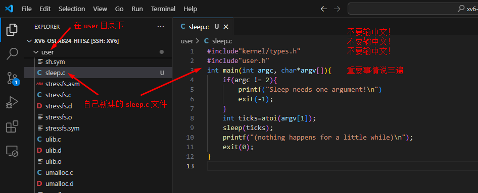

# Lab1：XV6与Unix实用程序


[点击这里：查看实验文档--XV6与Unix使用程序](https://os-labs.pages.dev/lab1/part1/)


这是第一个实验，目的是让大家熟悉 XV6 以及基本的 Unix 命令。本次实验需要实现3个Unix实用程序和xv6启动流程实验。


## 一、确保你的代码是在 util 分支

你需要熟悉 git 使用，如果对 git 不了解，请先看提前知识。

这里大部分都是 Linux 命令操作，如果不熟悉  Linux 命令，请先看提前知识。

我们这里使用 MobaXTerm 操作命令（你也可以在 VSCode 的 Terminal 操作，效果一样）

```bash
# 进入代码目录
cd xv6-oslab24-hitsz

# 切换到 util 分支
git checkout util

# 再次查看目录，你就可以看到很多代码文件了
ls -lh


```


## 二、首次编译XV6操作系统内核


**注意**：我们的实验是在 XV6 的基础上 “增加、修改” **一点点代码**。要让我们的代码跑起来，**首先 XV6 整个系统必须能正常运行**，然后我们 “增加、修改” 的一点点代码才能在 XV6 上运行。


所以，我们首先要确保 XV6 本身是可以正常运行的，下面是编译 XV6，让它运行起来。


```bash
# 注意： 确保你的命令执行是在代码目录 xv6-oslab24-hitsz 中（不要进到里面的子目录了），如果你的目录不对，下面命令会执行出错

# 编译 XV6
make qemu 

```




```
# 上面 XV6 已经运行了，现在我们需要退出 XV6 的运行

# 先按 ctrl+a 组合键，接着完全松开，再按 x，这样就能退出了

```


## 三、Sleep 实验


我们现在尝试在 XV6 上，添加一点点代码，实现一个 睡眠的功能。


1. **新建 user/sleep.c 文件，编写如下代码，理解代码和注释**


2. **输入代码**

   

```c
#include"kernel/types.h"
#include"user.h"
int main(int argc, char*argv[]){
    if(argc != 2){
        printf("Sleep needs one argument!\n"); //检查参数数里是否正确
        exit(-1);
    }
    int ticks=atoi(argv[1]);//f将字符串参数转为整数
    sleep(ticks);//使用系统调用s1eep 
    printf("(nothing happens for a little while)\n");
    exit(0);//确保进程退出
}
```


**常见错误注意**：关闭你电脑上的中文输入法，**不要输中文，不要输中文，不要输中文**。XV6 这种玩具系统是不支持中文的，你输了中文，系统会出错。中文包括 “汉字” 以及中文标点符号 “（），！。？...” ，中文标点符号看起来和英文标点符号很像，**一旦你输了中文标点符号，系统报错了，你看都看不出来**。





3. **把代码配置到XV6内核模块中去**

单纯把一个 sleep.c 放到代码目录中，XV6 是不会认这个文件的。要让 XV6 认这个文件，我们需要把这个文件模块配置到 Makefile 文件中。

**注意**：Makefile 文件不在  user 目录下，而是在 xv6-oslab24-hitsz 目录下，别找错地方了。

```
UPROGS=\
	$U/_cat\
	$U/_echo\
	$U/_forktest\
	$U/_grep\
	$U/_init\
	$U/_kill\
	$U/_ln\
	$U/_ls\
	$U/_mkdir\
	$U/_rm\
	$U/_sh\
	$U/_stressfs\
	$U/_usertests\
	$U/_grind\
	$U/_wc\
	$U/_zombie\
	$U/_sleep\

```


4. **运行 sleep 程序**，见下面图片

```
# 在 Visual Studio Code 的 Terminal 中，运行命令
make qemu 

```


XV6 系统已经启动了，接下来执行我们自己写的 sleep 命令，如下图

```bash
# 在 XV6 系统启动之后，我们执行自己的 sleep 命令
sleep 10 

```


5. 提出 XV6 系统

   看到  sleep 程序的输出，说明你成功为 XV6 系统添加了一个程序，接下来我们可以退出 XV6 系统了。

   > [!NOTE]
   >
   > 你还记得怎么退出 XV6 系统吗？
   >
   > 
   >
   > 先按 ctrl+a 组合键，接着完全松开，再按 x，这样就能退出了

   

   ## 四、继续剩余实验


有了前面的基础，你已经知道

1. 如何编译运行 XV6 系统
2. 如何给 XV6 系统添加一个 “自己的程序”


接下来，你需要根据实验中心的文档，自己完成剩下的实验任务了


[点击这里：查看实验中心文档--XV6与Unix使用程序](https://os-labs.pages.dev/lab1/part1/)


