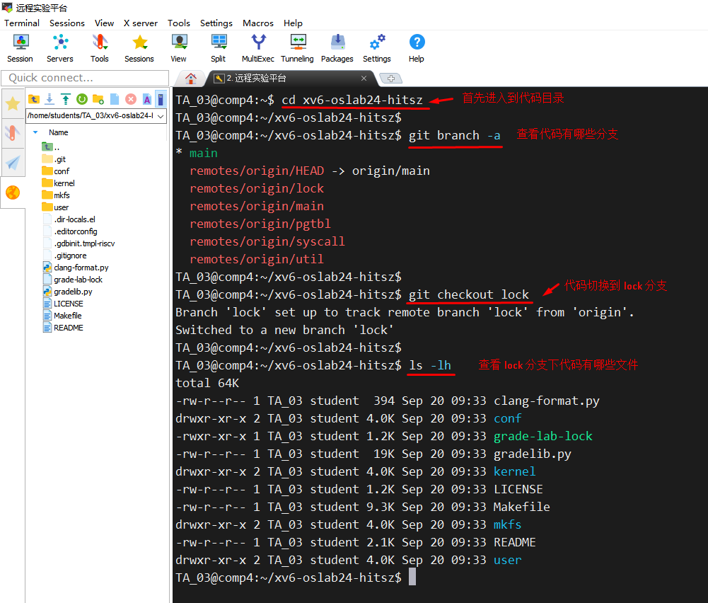
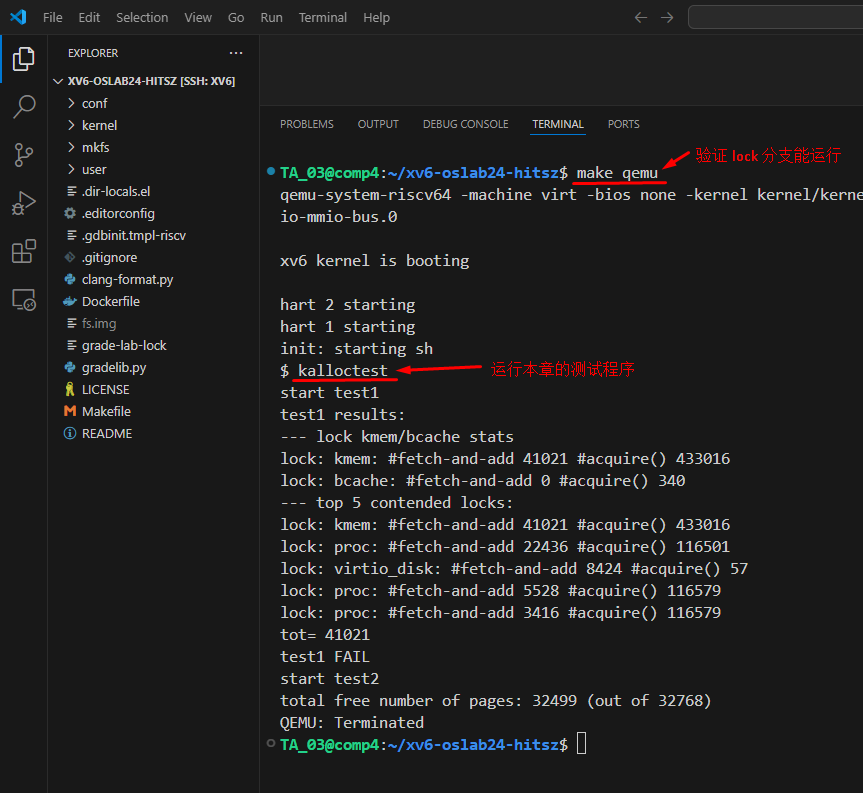
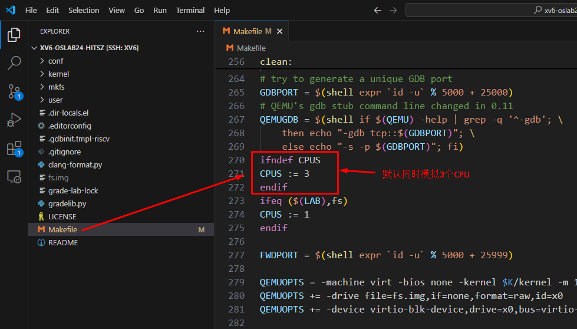
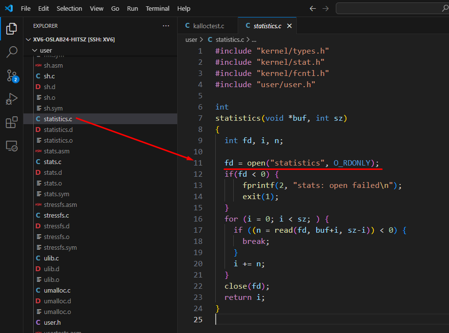
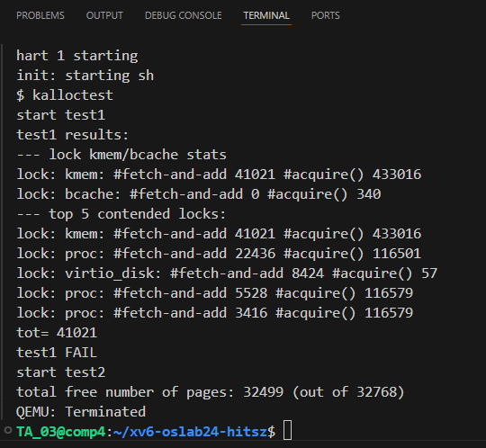

# Lab3：锁机制的应用


[点击这里：查看实验文档--锁机制的应用](https://os-labs.pages.dev/lab3/part1/)


## 一、代码切换到 lock 分支


这个实验需要在 lock 分支上操作，在操作之前，我们需要把代码切换到 lock 分支，操作如下：

```
# 代码采用 git 管理，git 里面有多个分支 branch ，查看代码的分支
git branch -a

# 切换到 lock 分支
git checkout lock 
```




## 二、用  VSCode 查看检查代码

代码切换到 lock 分支之后，我们用 VSCode 查看代码。首先，验证  lock 分支代码本身是正确可运行的，执行下面命令：

```
# 首先验证 lock 分支的代码是正确可运行的
make qemu 

# 模拟器运行起来之后，输入下面命令 查看本章节的测试程序输出
# 程序输出的内容后面会解释是什么含义
kalloctest 
```




## 三、检查 CPU 的配置

锁是用于**多CPU相互竞争共享资源**的时候，所以我们必须确保我们是真的**模拟了多个CPU**，这样锁机制才有意义。检查 Makefile 文件里面的配置：




## 四、实验基础知识

在做实验之前，有一些关于XV6内核的基础知识你需要知道，这些知识方便你理解实验到底要做什么。

1. ### statistics 内核统计

   XV6 系统会对系统 **锁的请求** 做统计，统计请求了锁多少次，成功多少次，失败多少次（别的进程已经获取了锁，你的程序这时请求锁就会失败，算失败一次，你的程序可以等一会再请求，如果别的进程还是没有释放锁，那你的程序再失败一次，继续等待，继续重试 ...）。

   所有**这些统计是 XV6 内核自己统计**的，你可以读取统计信息，获得系统锁的使用情况。写程序读取系统的统计信息如下：

   关键代码  **open("statistics", O_RDONLY)**，buf 里面就是读取出来的内容

   ```
   int statistics(void *buf, int sz)
   {
     int fd, i, n;
     
     fd = open("statistics", O_RDONLY);
     if(fd < 0) {
         fprintf(2, "stats: open failed\n");
         exit(1);
     }
     for (i = 0; i < sz; ) {
       if ((n = read(fd, buf+i, sz-i)) < 0) {
         break;
       }
       i += n;
     }
     close(fd);
     return i;
   }
   
   ```

   

   

2. ### kalloctest 程序

   lock 分支代码自带了一个程序  **user/kalloctest.c** ，这个程序的作用：

   （1）fork 两个进程，每个进程独立运行（3个CPU，2个进程，所以两个进程可以**同时运行**，**相互竞争资源**）

   （2）每个进程使用系统调用 **sbrk** ，让系统内核  （**分配内存、释放内存**）连续操作十万次

   （3）由于两个进程是同时运行，它们会相互抢内存，内核需要保证分配内存的过程是并发安全的（**用锁保证**并发安全）

   （4）内核对锁的**请求、获取、释放、成功、失败**会统计数据保存在 statistics 中

   （5）kalloctest **读取内核的 statistics 数据**，**并且打印出来**，让你可以看到内核锁的使用情况

   （6）kalloctest 开始获取一次 锁失败次数， 然后 fork 进程，结束再获取一次 锁失败次数，如果**两次差值 < 10 就算测试通过**

   ​	 意思是 fork 的进程经过 10万次内存申请释放，失败次数不到10次，说明内存锁的效率很高

   

3. ### kalloctest 打印数据的解释

   kalloctest 读取内核的 statistics 数据，显示如下：

   

   ```
   # 我们只需要关注这一块就够了
   
   --- lock kmem/bcache stats
   lock: kmem: #fetch-and-add 41021 #acquire() 433016
   lock: bcache: #fetch-and-add 0 #acquire() 340
   
   # 解释如下
   
   lock: kmem: #fetch-and-add 41021 #acquire() 433016
   内核分配锁，请求 433016 次， 失败 41021 次
   
   lock: bcache: #fetch-and-add 0 #acquire() 340
   文件缓存锁，请求 340 次，失败 0 次
   
   ```

   ```
   --- top 5 contended locks:
   lock: kmem: #fetch-and-add 41021 #acquire() 433016
   lock: proc: #fetch-and-add 22436 #acquire() 116501
   lock: virtio_disk: #fetch-and-add 8424 #acquire() 57
   lock: proc: #fetch-and-add 5528 #acquire() 116579
   lock: proc: #fetch-and-add 3416 #acquire() 116579
   tot= 41021
   
   tot 就是 lock: kmem 的失败次数
   
   kalloctest 使用 tot 的两次差值来判断是否通过测试，差值 < 10 就算通过
   
   1. 开始前，获取一次 tot
   2. fork 两个进程，同时10万次分配内存、释放内存
   3. 结束，获取一次 tot
   4. 两次 toto 差值小于 10 ，就算通过，说明 分配10万次内存，锁失败不到10次
   
   ```

   

4. ### 实验说明

   （1）**你需要改内核代码**，提高锁的使用效率，让失败次数减少

   （2）内核代码改了，怎么知道自己改的有没有效果？ 运行 kalloctest 程序查看数据有没有改善（**失败次数明显变少**）

   （2）**kalloctest 不要改动**，这个程序只是打印内核统计数据，方便你知道自己改内核有没有效果的


## 五、实验任务


[任务一：内存分配器（Memory allocator）](Task01.md)


[任务二：磁盘缓存（Buffer cache）](Task02.md)
