# 任务一：内存分配器（Memory allocator）


修改内存分配器（**主要修改kernel/kalloc.c**） ，使每个CPU核使用独立的内存链表，而不是现在的共享链表。

XV6的内存分配器**只有一个内存链表供多个CPU核使用**。在使用kalloc()获取内存时，由于添加了内存锁kmem.lock，其他CPU如果要切换进行内存申请必须等待当前进程释放内存锁。要消除锁争用的情况，需要重新设计内存链表管理机制以避免单个锁和单个链表。实验基本任务是**让每个CPU拥有自己的内存链表**，**每个链表都有自己的锁**。其中最具挑战的就是，当一个CPU内存链表不足时，还可以从其他链表 **窃取** 内存块，这样，就不会让所有的CPU争抢一个空闲区域（窃取可能会引发锁争用，但这也是不可避免的情况）。


## 任务要求：

1) 请使用initlock()初始化锁，并要求锁名字以kmem开头；
2) 运行kalloctest查看实现的代码是否减少了锁争用（tot没有获取到此锁的次数小于10则为通过）；
3) 运行 usertests sbrkmuch 以测试修改代码后系统是否仍可以分配所有的内存；
4) 运行usertests，确保其能能够全部通过；
5) kalloctest和usertests的输出如下图（锁争用的次数大大减少），具体的数据会有所差别：


## 代码下载

[点击下载--单文件 kalloc.c 文件](https://github.com/hitsz-ids/OS-Kernel-system-software-tutorial/blob/4be0a66d8bcacb297e6864e02422765c1e8ccfa7/Chapter05/kalloc.c) 


[点击下载--完整代码包](xv6-kmem.tar.bz2)


## 原始代码：只有一个内存锁

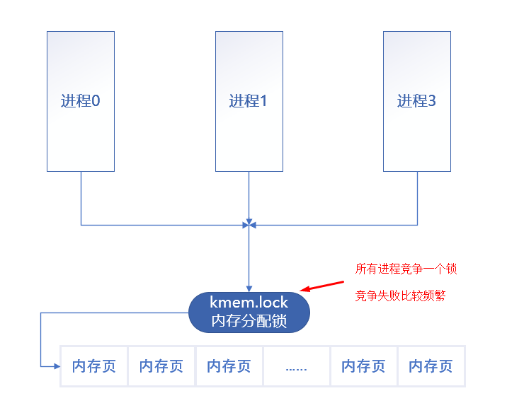


##  修改代码：多个内存队列，多个锁，减少竞争


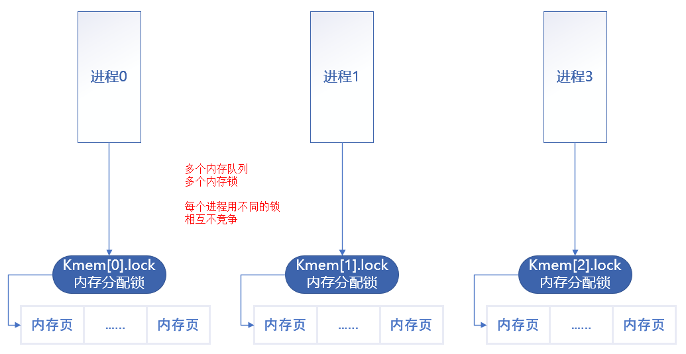


## 一、每个CPU一个内存链

首先，仔细阅读 **kernel/kalloc.c** 的代码，看明白：

（1）所有内存挂在一个链表上，由一个锁保护

```
struct {
  struct spinlock lock;
  struct run *freelist;
} kmem;
```

（2）任何进程分配内存，都需要**先锁住这个链表**，所以当多个进程都要分配内存的时候，前面一个进程锁住了链表，后面一个进程获取锁就会失败，这就是锁的竞争

```
# 看代码中两个函数

void kfree(void *pa)

void* kalloc(void)

```


所以，要降低这种竞争，我们可以拆分多个链表，**每个 CPU一个链表**，进程只从自己运行的CPU链表上分配内存。这样不同进程运行在不同的CPU上，分配内存的链表各不相干，就没有了锁竞争。修改代码如下：

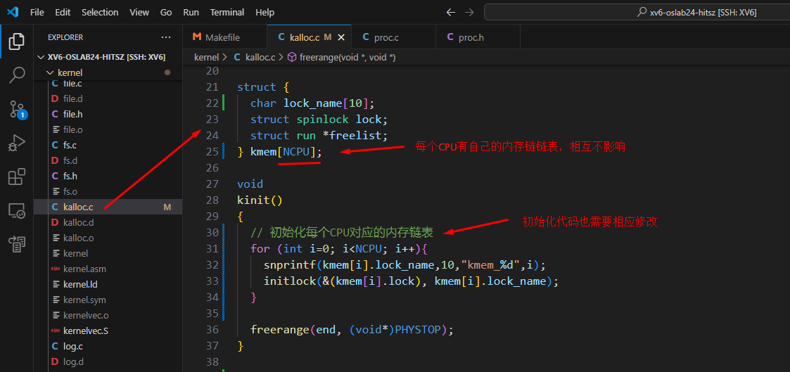


注意：NCPU 在 **kernel/param.h** 中定义，一共是 **8个CPU**


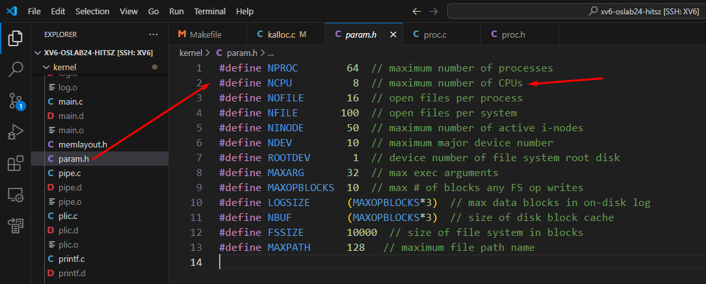


## 二、进程只在自己的CPU链表上分配、释放内存


每个进程**只在自己CPU的链表**上分配、释放内存，这样多个进程就不用抢同一个锁了。修改代码如下

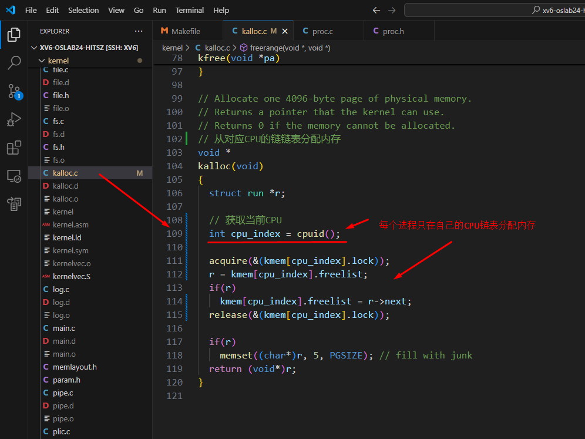


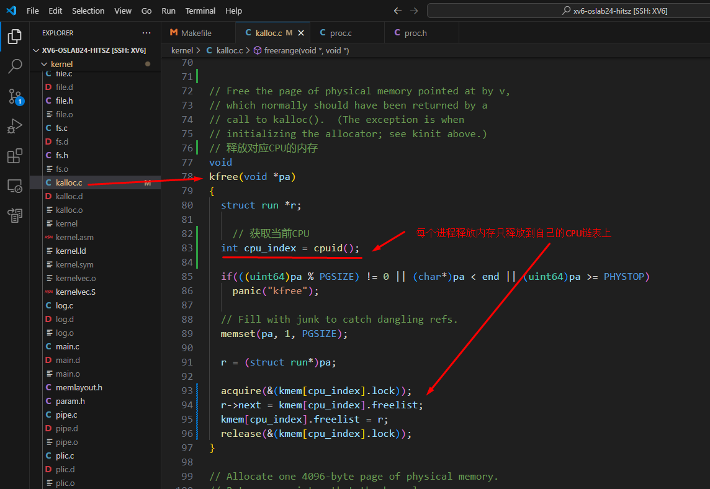


## 三、系统启动的首次内存分配


系统开机的时候，所有的物理内存需要做首次分配，我们把物理内存平均分配给每个CPU，代码如下：

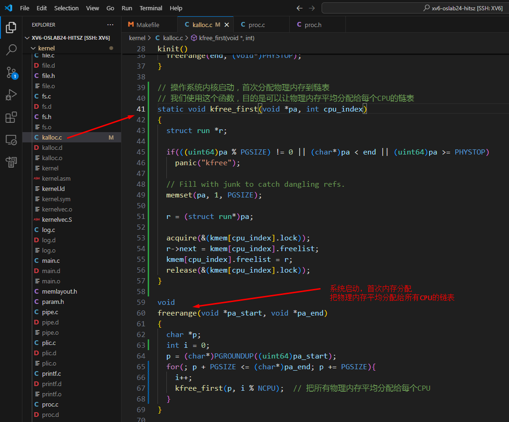


## 四、测试效果

我们给每个CPU都分配了一个内存链表，每个进程只在自己运行的CPU对应链表分配、释放内存。所以，理论上，他们根本不会竞争内存。

进程1 ，运行在 CPU 1 上，从 CPU1 的链表分配内存。

进程2 ，运行在 CPU 2 上，从 CPU2 的链表分配内存。

进程1，进程2 根本不存在竞争内存的关系。

我们运行 **kalloctest** 程序来检测一下我们内核修改的效果

```
# 启动XV6
make qemu

# 运行 kalloctest 测试我们内核修改的效果
kalloctest 
```

可以看到，**内存锁失败为0**，全都是成功的。说明我们内核修改正确。

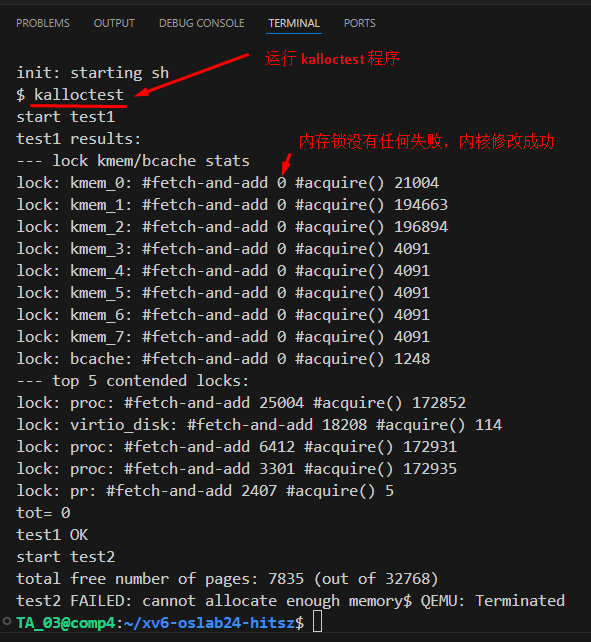


[点击这里--查看 kalloc.c 代码的修改](https://github.com/hitsz-ids/OS-Kernel-system-software-tutorial/commit/045a6234df342e7ed152e7b23ad9da2e0169fcdd)


## 五、内存不足的问题


前面 kalloctest 运行结果，最后有一个错误，看下图：

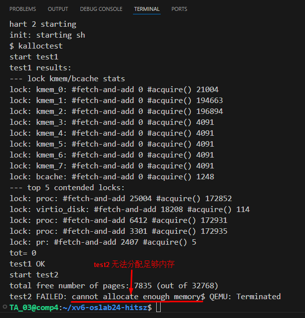


为什么会出现无法分配足够内存的情况？因为：

（1）我们把内存平均分配给了8个CPU，所以**每个CPU只有 1/8 的内存容量**可以分配

（2）不同CPU的内存分配相互独立，互相不能借用对方的内存，导致一个CPU内存分配完之后，就没内存可用了


解决这个问题的方法：**允许从别的CPU借内存**。


## 六、进程可以从别的CPU分配内存


接下来，我们修改程序，当进程自己的CPU没有内存可分的时候，我们允许进程从别的CPU上分配内存。

代码修改如下：

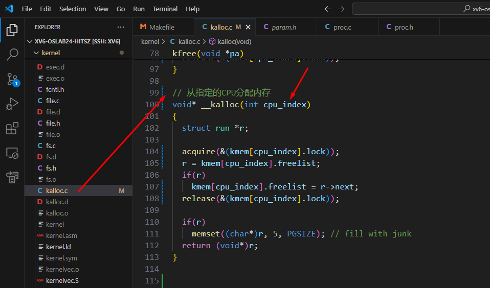


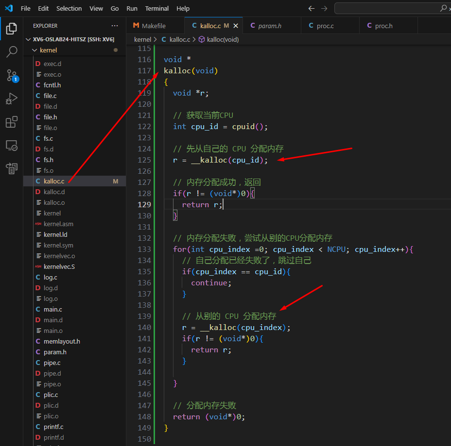


## 七、再次测试

```
# 启动XV6
make qemu

# 运行 kalloctest 测试我们内核修改的效果
kalloctest 
```


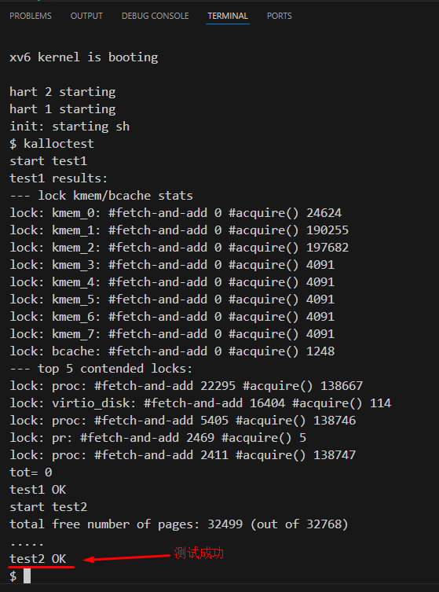


​		[点击这里--查看代码修改](https://github.com/hitsz-ids/OS-Kernel-system-software-tutorial/commit/4be0a66d8bcacb297e6864e02422765c1e8ccfa7)


