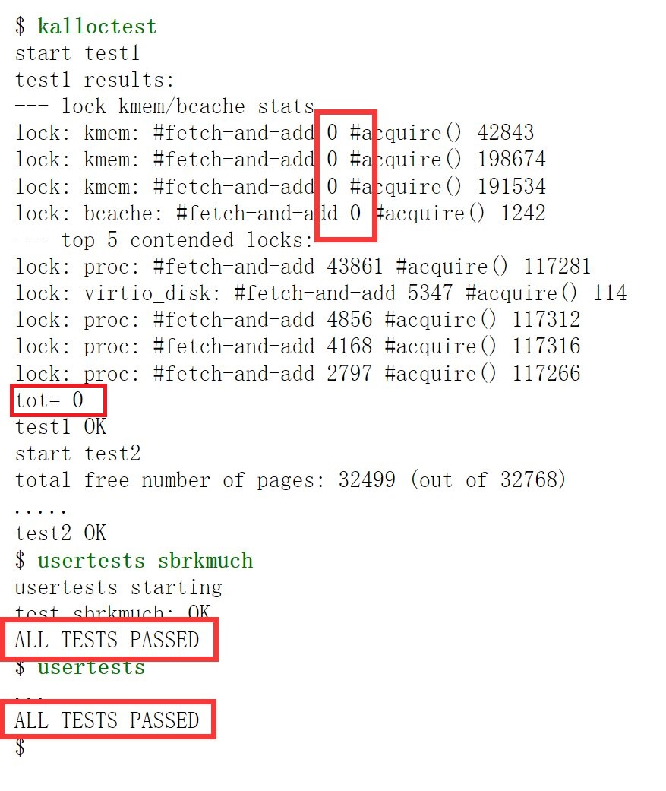

# 任务一：内存分配器（Memory allocator）


修改内存分配器（**主要修改kernel/kalloc.c**） ，使每个CPU核使用独立的内存链表，而不是现在的共享链表。

XV6的内存分配器**只有一个内存链表供多个CPU核使用**。在使用kalloc()获取内存时，由于添加了内存锁kmem.lock，其他CPU如果要切换进行内存申请必须等待当前进程释放内存锁。要消除锁争用的情况，需要重新设计内存链表管理机制以避免单个锁和单个链表。实验基本任务是**让每个CPU拥有自己的内存链表**，**每个链表都有自己的锁**。其中最具挑战的就是，当一个CPU内存链表不足时，还可以从其他链表 **窃取** 内存块，这样，就不会让所有的CPU争抢一个空闲区域（窃取可能会引发锁争用，但这也是不可避免的情况）。


## 任务要求：

1) 请使用initlock()初始化锁，并要求锁名字以kmem开头；
2) 运行kalloctest查看实现的代码是否减少了锁争用（tot没有获取到此锁的次数小于10则为通过）；
3) 运行 usertests sbrkmuch 以测试修改代码后系统是否仍可以分配所有的内存；
4) 运行usertests，确保其能能够全部通过；
5) kalloctest和usertests的输出如下图（锁争用的次数大大减少），具体的数据会有所差别：



## 一、每个CPU一个内存链

首先，仔细阅读 **kernel/kalloc.c** 的代码，看明白：

（1）所有内存挂在一个链表上，由一个锁保护

```
struct {
  struct spinlock lock;
  struct run *freelist;
} kmem;
```

（2）任何进程分配内存，都需要**先锁住这个链表**，所以当多个进程都要分配内存的时候，前面一个进程锁住了链表，后面一个进程获取锁就会失败，这就是锁的竞争

```
# 看代码中两个函数

void kfree(void *pa)

void* kalloc(void)

```


所以，要降低这种竞争，我们可以拆分多个链表，**每个 CPU一个链表**，进程只从自己运行的CPU链表上分配内存。这样不同进程运行在不同的CPU上，分配内存的链表各不相干，就没有了锁竞争。修改代码如下：


