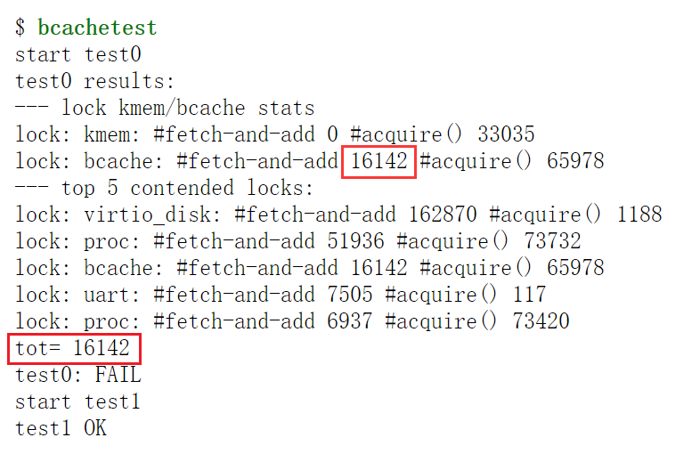
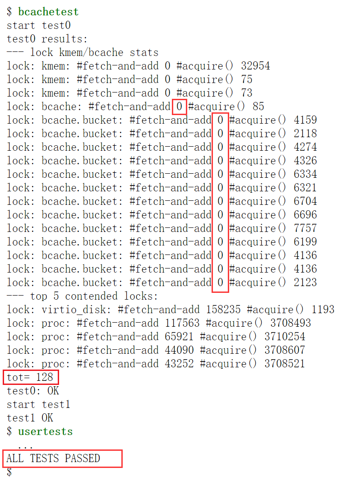

# 任务二：磁盘缓存（Buffer cache）

在访问文件数据的时候，操作系统会将文件的数据放置在磁盘缓存中。磁盘缓存是不同进程之间的共享资源，因此需要通过锁确保使用的正确性。如果有多进程密集地使用文件系统，他们可能会竞争磁盘缓存的 **bcache.lock** 锁。

目前，xv6采用单个锁来管理磁盘缓存。假设有三个进程大量读写磁盘，而由于磁盘缓存只有一个bcache.lock锁，这就导致三个进程的竞争异常激烈。因此，我们需要 修改磁盘缓存块列表的管理机制（主要修改**kernel/bio.c**） ，使得可用多个锁管理缓存块，从而减少缓存块管理的锁争用。

## 关于测评程序bcachetest

测评程序bcachetest（见 **user/bcachetest.c**）通过创建多个进程重复去读取不同的文件，从而造成bcache.lock锁争用。

测试方式如下：

实验前（即未修改前），测评程序bcachetest的输出如下：

可以看到，bcache 的 fetch-and-add 值非常大，说明磁盘缓存锁的争用非常严重。

修改buffer cache的设计后，所有锁的fetch-and-add的**数目应当接近于0**。

## 任务要求

本实验要求大家在XV6原版的bcache基础上，修改磁盘缓存块列表的管理机制，主要修改 **kernel/bio.c**。也就是，在原有的磁盘缓存大小的基础上，可采用多个哈希桶、时间戳、或CLOCK算法等优化策略来减少磁盘缓存的锁争用。故以下修改是不允许的：

1. 不允许修改NBUF的大小；
2. 不允许修改 buf 的数量，比如设置N个struct buf [NBUF]；
3. 不允许随意修改锁的命名，本任务涉及到的锁必须以 bcache 开头来命名。

- 理想状态下，`bcachetest`中数据块缓存相关的所有锁`fetch-and-add`的**总和应该为0**，但本实验中总和`tot`**不超过500即可**；
- 请修改`bget()`和`brelse()`，使得缓存区并发的查询和释放不容易发生锁争用，比如，不是所有流程都得等bcache.lock；
- 同样要求`usertests`中的用例全部通过，最后的输出如下（具体数据有所出入）：

**在运行`make qemu`测试`bcachetest`和`usertests`之前，建议先运行`make clean`删除`fs.img`** ，以防之前错误的代码把磁盘写坏了，后面即使是改成正确的代码也没法执行。

## 代码实现

参考  [任务一：内存分配器（Memory allocator）](Task01.md)学生动手完成这个任务

