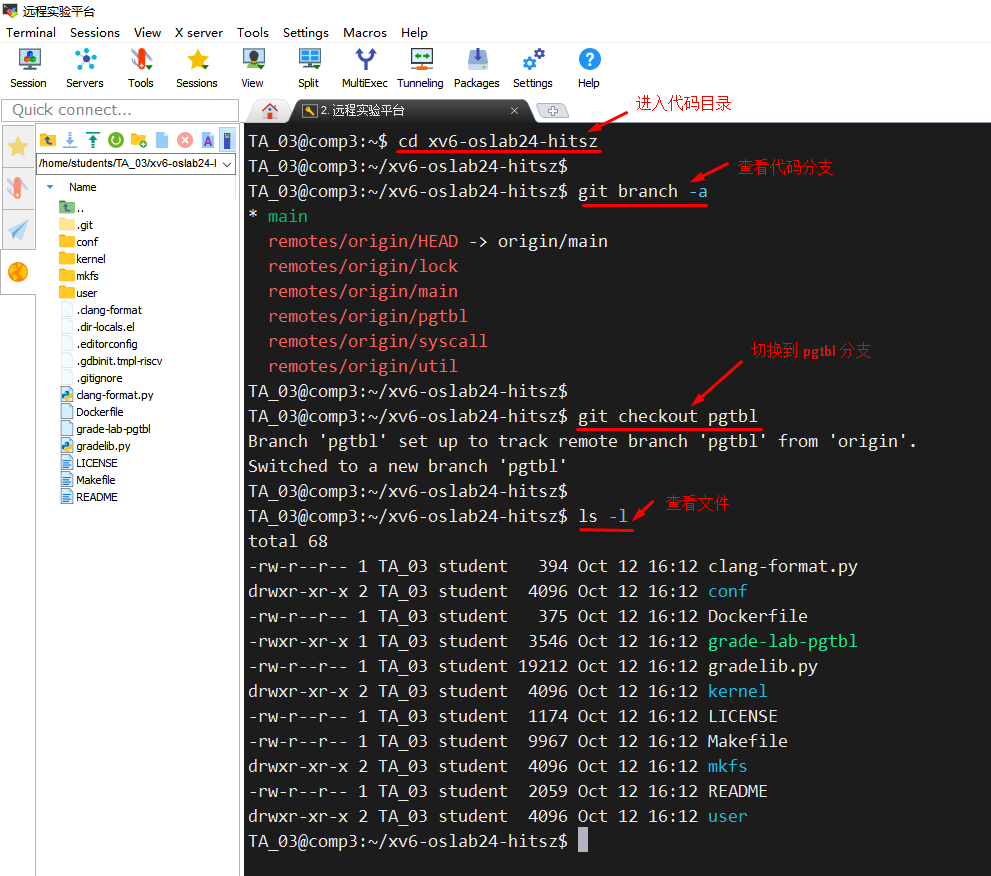
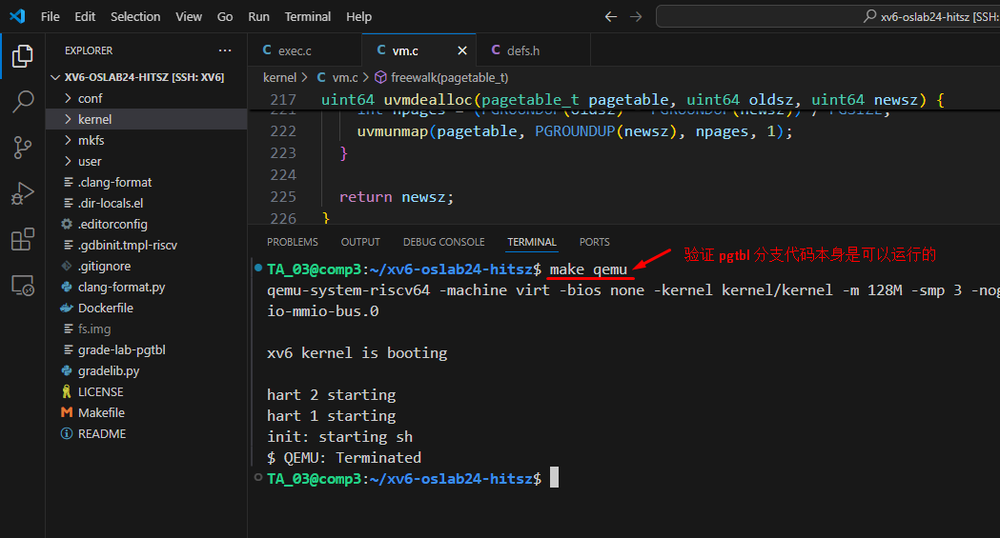

# Lab4：页表


[点击这里：查看实验文档--页表](https://os-labs.pages.dev/lab4/part1/)


## 一、代码切换到 pgtbl 分支

这个实验需要在 pgtbl 分支上操作，在操作之前，我们需要把代码切换到 pgtbl  分支，操作如下：

```
# 代码采用 git 管理，git 里面有多个分支 branch ，查看代码的分支
git branch -a

# 切换到 lock 分支
git checkout pgtbl  
```




## 二、用  VSCode 查看检查代码


代码切换到 pgtbl分支之后，我们用 VSCode 查看代码。首先，验证  pgtbl分支代码本身是正确可运行的，执行下面命令：

```
# 首先验证 pgtbl 分支的代码是正确可运行的
make qemu 

```




## 三、页表的结构说明


实验中心的文档已经很清楚了，点击下面链接查看

[点击这里：分页原理](https://os-labs.pages.dev/lab4/part2/)


## 四、实验任务


[任务一：打印页表](Task01.md)


[任务二：独立内核页表](Task02/Task02.md)


