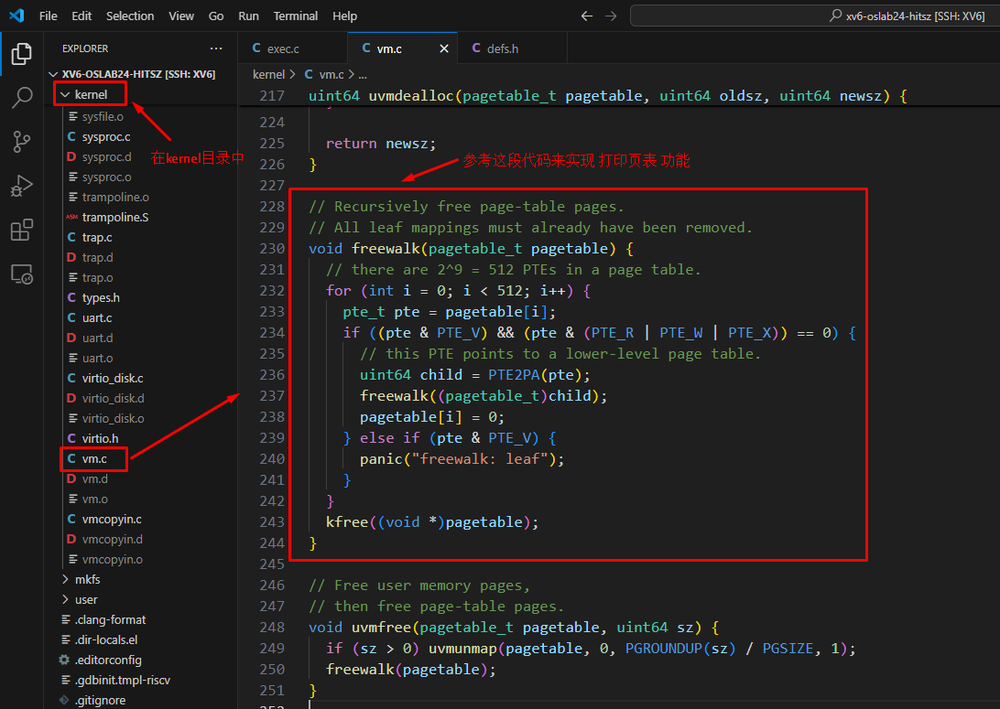
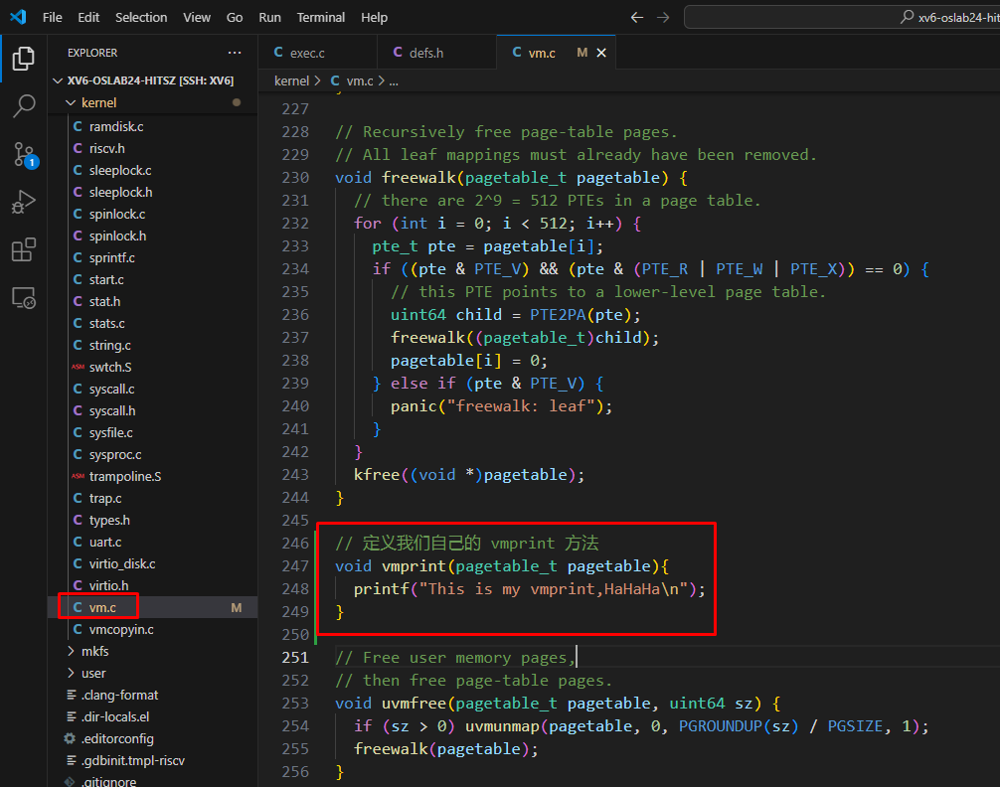
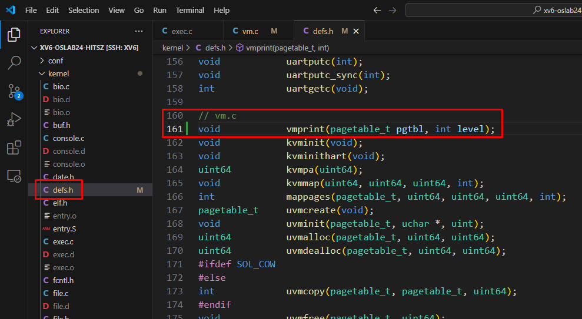
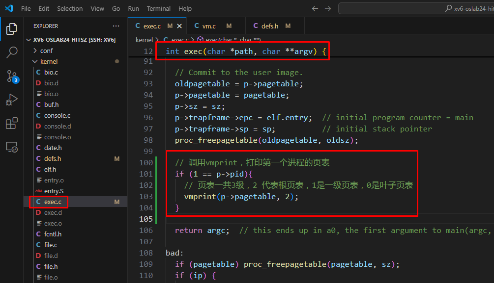
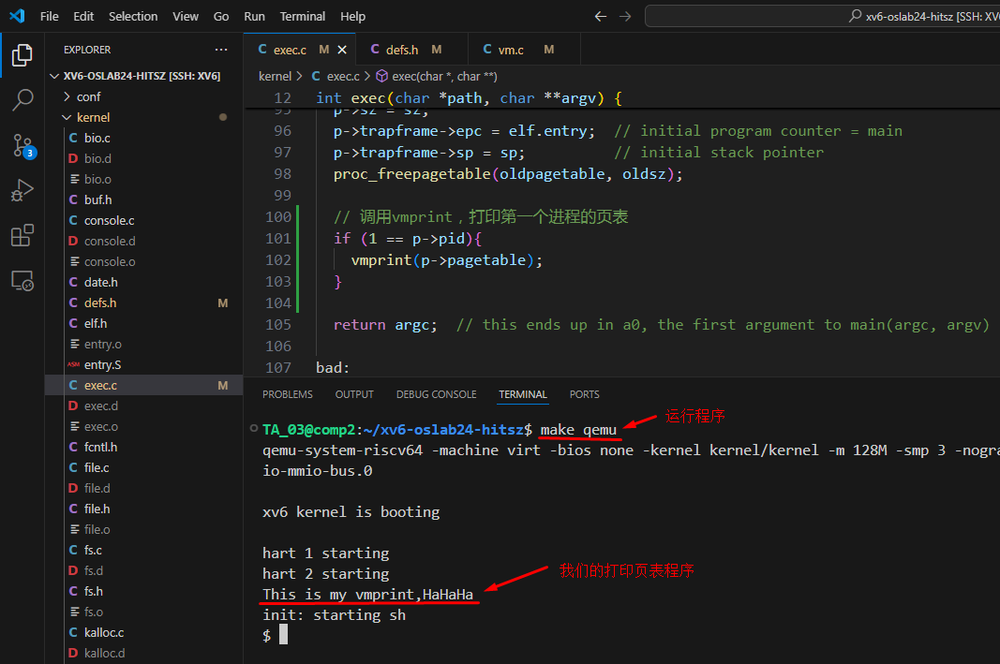
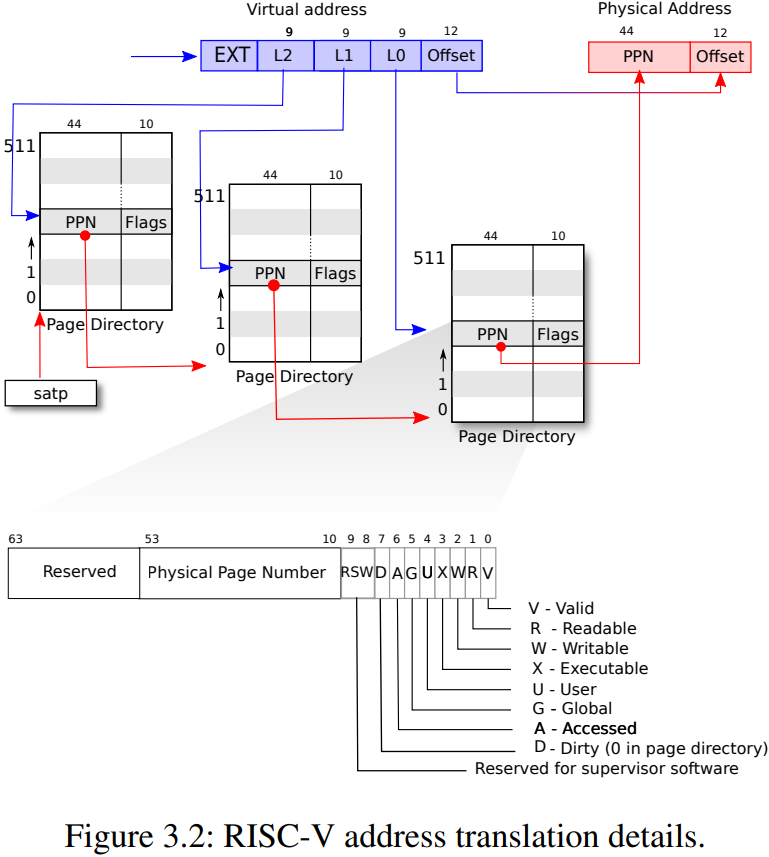
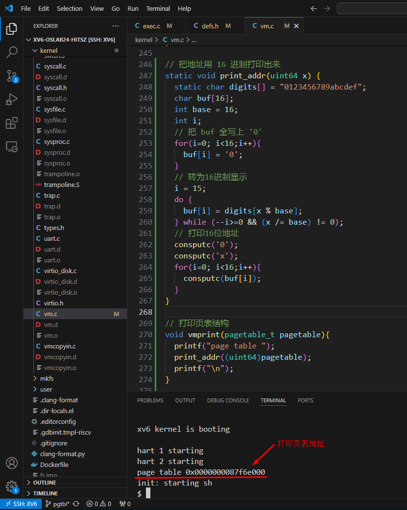

# 任务一：打印页表


## 一、页表代码实现


首先，你需要读懂页表的结构，实验中心的文档已经很清楚了，点击下面链接查看

[点击这里：分页原理](https://os-labs.pages.dev/lab4/part2/)


```c
内核中页表的实现主要在代码 kernel/vm.c 文件中
对照上面的分页原理，仔细阅读代码

对于实现本任务，最有效的参考代码是  

void freewalk(pagetable_t pagetable)

```





## 二、打印页表代码框架


现在，我们先把打印页面的代码框架实现出来，然后再去实现具体功能。

1. ### 在 vm.c 加入 vmprint 方法 

   

   [点击这里--查看代码修改](https://github.com/hitsz-ids/OS-Kernel-system-software-tutorial/commit/c44802d2e85b0df4354e0ec666b08363cdf55c21)

   

   ```c
   // 定义我们自己的 vmprint 方法
   void vmprint(pagetable_t pagetable){
     printf("This is my vmprint,HaHaHa\n");
   }
   ```

   




2. ### 需要把定义加入到 defs.h 文件中

   

   [点击这里--查看代码修改](https://github.com/hitsz-ids/OS-Kernel-system-software-tutorial/commit/7a77972a851d6fe57edcd9bd31875e5964968fe4)

   

   我们的 vmprint 要被别的程序调用，必须把函数的定义加入到 defs.h 文件中，否则别的程序无法调用我们

   ```c
   // vm.c
   void vmprint(pagetable_t pagetable);
   ```

   


3. ### 在 exec 中，调用我们的 vmprint

   

   [点击这里--查看代码修改](https://github.com/hitsz-ids/OS-Kernel-system-software-tutorial/commit/15ac1e7250adc4acfa546dd0b62d6c340d5a7aff)

   

   ```c
     // 调用vmprint，打印第一个进程的页表
     if (1 == p->pid){
       vmprint(p->pagetable);
     }
   ```

   


4. ### 运行程序查看结果

   ```
   # 运行程序，查看结果
   make qemu
   ```

   


## 三、页表的三级结构


你需要对三级页表的结构非常熟悉才能实现页表打印，下面是原理，请仔细看懂它


[点击这里：分页原理](https://os-labs.pages.dev/lab4/part2/)


虚拟地址分为三级，对应三级页表（L2, L1, L0），确定你真的看懂了下面这张图的含义。看懂了这张图，你就可以实现页表打印功能了。





## 四、实现页表结构打印

​	

```
我们参考 kernel/vm.c 文件中 freewalk 来实现

void freewalk(pagetable_t pagetable)
```


1. ### 实现地址的打印


[点击这里--查看代码修改](https://github.com/hitsz-ids/OS-Kernel-system-software-tutorial/commit/1fec8fa7ff395b46233e8fd3fc1c19b29fd90ca4)


​	物理地址是比较长的整数，我们需要按16进制的方式打印出来

```c
// 把地址用 16 进制打印出来
static void print_addr(uint64 x) {
  static char digits[] = "0123456789abcdef";
  char buf[16];
  int base = 16;
  int i;
  // 把 buf 全写上 '0'
  for(i=0; i<16;i++){
    buf[i] = '0';
  }
  // 转为16进制显示
  i = 15;
  do {
    buf[i] = digits[x % base];
  } while (--i>=0 && (x /= base) != 0);
  // 打印16位地址
  consputc('0');
  consputc('x');
  for(i=0; i<16;i++){
    consputc(buf[i]);
  }
}

// 打印页表结构
void vmprint(pagetable_t pagetable){
  printf("page table ");
  print_addr((uint64)pagetable);
  printf("\n"); 
}
```




2. ### 实现页表的递归打印

​	三级页表，我们采用递归的方式来打印。


