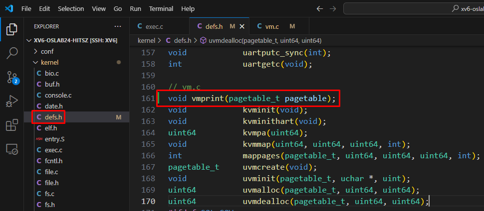
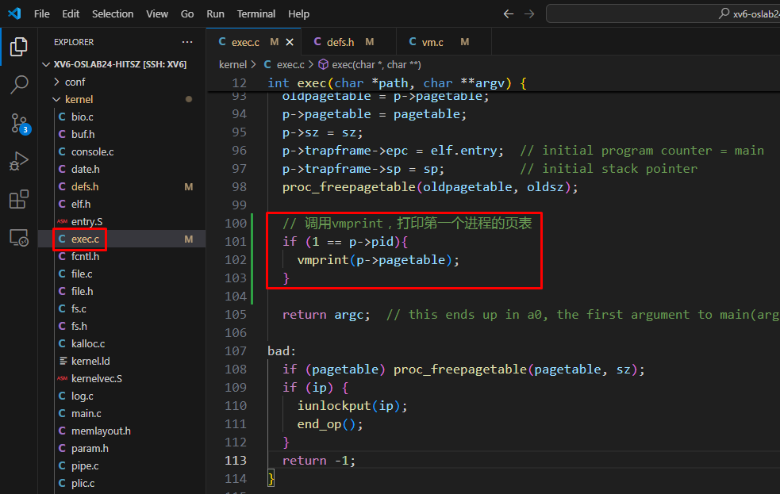

# 任务一：打印页表


## 一、页表代码实现


首先，你需要读懂页表的结构，实验中心的文档已经很清楚了，点击下面链接查看

[点击这里：分页原理](https://os-labs.pages.dev/lab4/part2/)


```
内核中页表的实现主要在代码 kernel/vm.c 文件中
对照上面的分页原理，仔细阅读代码

对于实现本任务，最有效的参考代码是  

void freewalk(pagetable_t pagetable)

```


## 二、打印页表代码框架


现在，我们先把打印页面的代码框架实现出来，然后再去实现具体功能。

1. ### 在 vm.c 加入 vmprint 方法 

   

   [点击这里--查看代码修改](https://github.com/hitsz-ids/OS-Kernel-system-software-tutorial/commit/6d10111426ea50b276734cf0e710c787595e5ae8)

   

   ```
   // 定义我们自己的 vmprint 方法
   void vmprint(pagetable_t pgtbl, int level){
     printf("This is my vmprint,HaHaHa\n");
   }
   ```

   


2. ### 需要把定义加入到 defs.h 文件中

   

   [点击这里--查看代码修改](https://github.com/hitsz-ids/OS-Kernel-system-software-tutorial/commit/5a8cd18c18acd2942cd851094783bb119a324e38)

   

   我们的 vmprint 要被别的程序调用，必须把函数的定义加入到 defs.h 文件中，否则别的程序无法调用我们

   ```
   // vm.c
   void            vmprint(pagetable_t pgtbl, int level);
   ```

   


3. ### 在 exec 中，调用我们的 vmprint

   

   [点击这里--查看代码修改](https://github.com/hitsz-ids/OS-Kernel-system-software-tutorial/commit/1a9be05cafbaae0c758a27a9a204c1785a6cf22c)

   

   ```
     // 调用vmprint，打印第一个进程的页表
     if (1 == p->pid){
       // 页表一共3级，2 代表根页表，1是一级页表，0是叶子页表
       vmprint(p->pagetable, 2);
     }
   ```

   


4. ### 运行程序查看结果

   ```
   # 运行程序，查看结果
   make qemu
   ```

   

