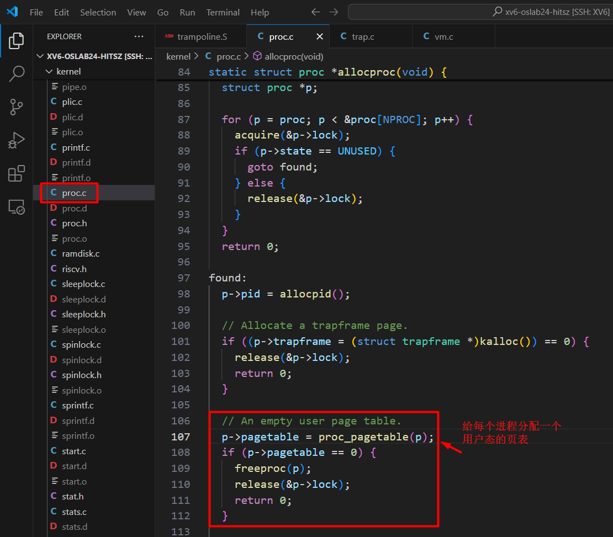
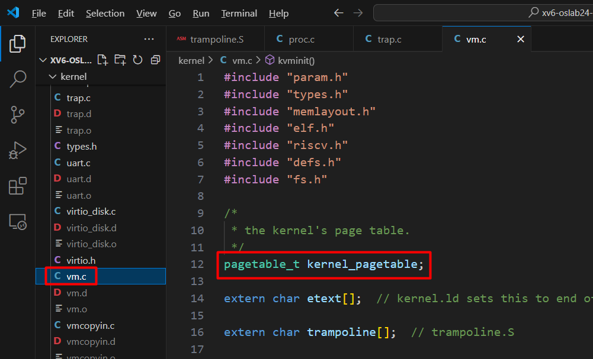
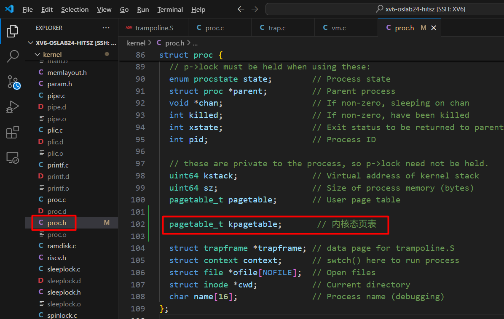
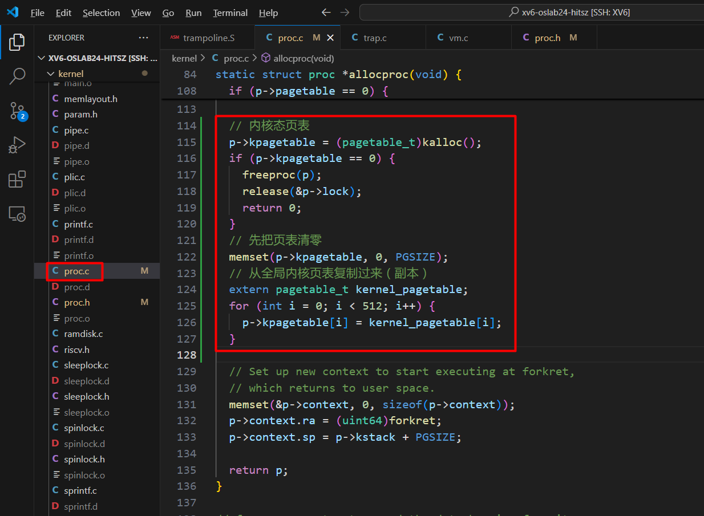
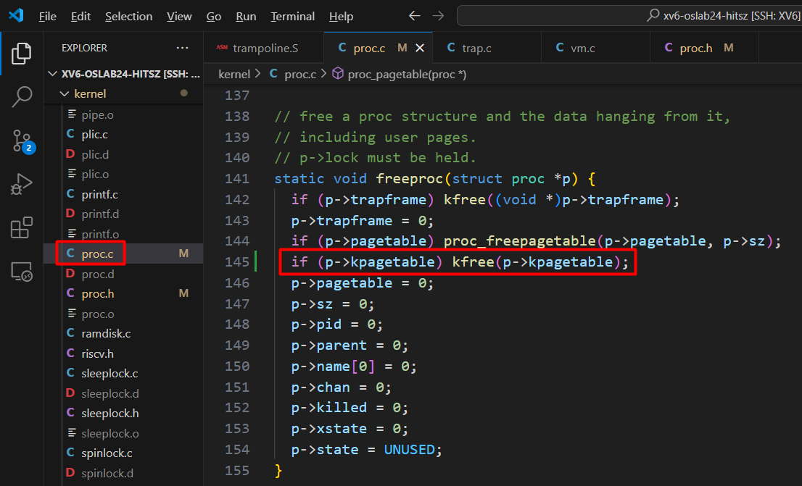
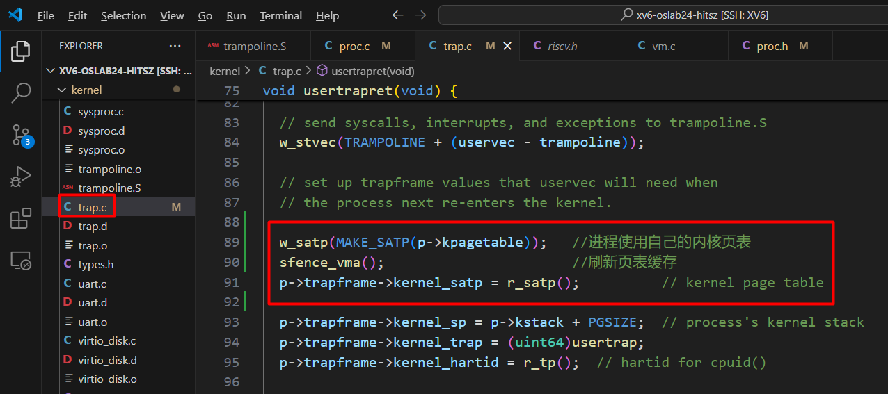
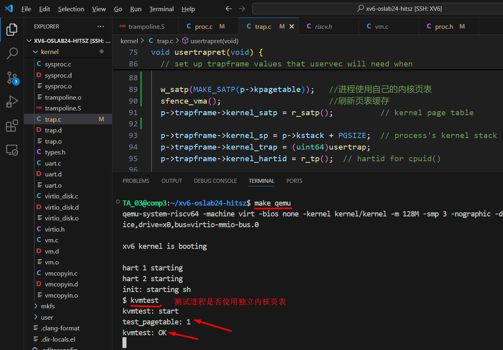

# 任务二：独立内核页表


首先，你需要读懂页表的结构，实验中心的文档已经很清楚了，点击下面链接查看

[点击这里：分页原理](https://os-labs.pages.dev/lab4/part2/)


[点击这里：下载本章节代码](code.zip)


[点击这里：下载完整代码包](xv6-oslab24-hitsz-pgtbl-task02.tar.bz2)


XV6 默认的设计中，每个进程有一个自己的 **用户态页表**，但是系统调用进入内核之后会切换为**内核页表**，并且整个系统中只有唯一的一个全局内核页表。这个任务是要改造内核页表，让**每个进程都有一个自己的内核页表**，不再是全局共享唯一的一个内核页表。


## 一、页表


1. ### 每个进程一个页表


```
# 在文件 kernel/proc.c 中
```




2. ### 内核全局唯一页表

```
在代码  kernel/vm.c  中定义了内核页面全局变量
```





## 二、给进程增加自己的内核页表


1. ### 修改进程结构

   

   [点击这里--查看代码修改](https://github.com/hitsz-ids/OS-Kernel-system-software-tutorial/commit/b0092bc711b9eaddd586b8bbe34dd81858f711d2)

   

现在的定义中，每个进程只有一个用户态页表，我们需要给每个进程再增加一个内核页表。在 **kernel/proc.h** 文件中加入：

```c
pagetable_t kpagetable;       // 内核态页表
```





2. ### 给每个进程分配内核页表（副本）


[点击这里--查看代码修改](https://github.com/hitsz-ids/OS-Kernel-system-software-tutorial/commit/c88bbf82763307d14e173963aa806edd160c4a8b)


进程结构中已经有了内核页表的变量，我们需要在创建进程的时候创建一个内核页表的副本，在 **kernel/proc.c** 中加入代码：

```c
  // 内核态页表
  p->kpagetable = (pagetable_t)kalloc();
  if (p->kpagetable == 0) {
    freeproc(p);
    release(&p->lock);
    return 0;
  }
  // 先把页表清零
  memset(p->kpagetable, 0, PGSIZE);
  // 从全局内核页表复制过来（副本）
  extern pagetable_t kernel_pagetable;
  for (int i = 0; i < 512; i++) {
    p->kpagetable[i] = kernel_pagetable[i];
  }

```




在进程销毁的时候，我们也要释放这个内核页表。在 **kernel/proc.c** 中加入代码：

```c
 if (p->kpagetable) kfree(p->kpagetable);
```




## 三、进程使用自己的内核页表


[点击这里--查看代码修改](https://github.com/hitsz-ids/OS-Kernel-system-software-tutorial/commit/ef134ce841df62448c5269f33e22dfcb4912b1dd)


现在每个进程已经有了自己的内核页表，接下来我们需要让每个进程使用自己的内核页表。进程通过系统调用或者中断进入内核状态，这个时候XV6会把进程的页表从用户态页表切换到内核态页表，代码在 **kernel/trap.c**  中 我们修改代码  ：


```c
  w_satp(MAKE_SATP(p->kpagetable));   //进程使用自己的内核页表
  sfence_vma();                       //刷新页表缓存
  p->trapframe->kernel_satp = r_satp();          // kernel page table

```





### 四、测试进程是否已经使用自己的内核页表

```bash
# 启动 qemu
make qemu

# 测试
kvmtest

```





