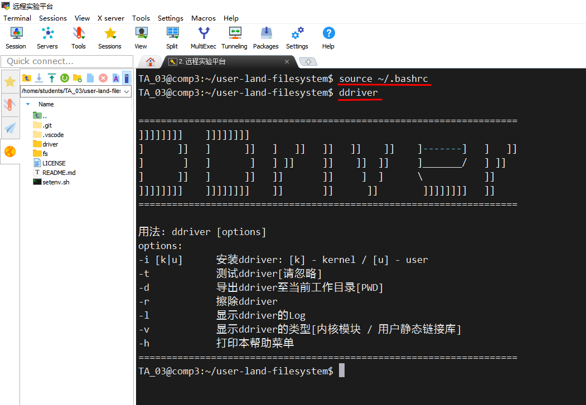

# Lab5：基于FUSE的青春版EXT2文件系统


[点击这里：查看实验文档--基于FUSE的青春版EXT2文件系统](https://os-labs.pages.dev/lab5/part1/)


## 一、特别提醒


这一章文件系统实验**和XV6 系统无关**，所以前面学的 ```make qemu```之类在这里不适用的。这一章用的是 Linux 系统的 Fuse 文件系统做实验，是在 x86_64 电脑上操作的实验，**不是用 qemu 模拟器**。


这一章用的代码是 ```user-land-filesystem``` 和之前的代码 ```xv6-oslab24-hitsz```没有任何关系，完全**是不相干的两份代码**。所以不要用之前的代码来想现在这个实验。```user-land-filesystem```是独立编译、独立运行、独立测试的代码，**和之前XV6代码完全无关**。


## 二、下载实验代码


```shell
git clone https://gitee.com/ftutorials/user-land-filesystem.git
```


## 三、设置实验环境


这份代码需要**先设置实验环境**，然后才能使用。如果不设置环境，后面你的编译会无法进行。进入到代码目录，运行命令设置环境：

```shell
cd user-land-filesystem

./setenv.sh

新工程名，我们设置为 newfs (注意：有两个地方要输入，都输入 newfs)
```


## 四、让环境生效


之所以单独做一节，就是确保你一定看到了要运行这个命令。

```
source ~/.bashrc
```


运行上面命令之后，检查环境是否生效：

```
# 运行下面命令
ddriver

# 如果有下图的输出，说明你的环境生效了，后面的编译、运行可以正常工作了
```





## 五、代码结构


本章节实验的代码在 fs 目录下，执行下面命令：

```
cd fs

ls -lh

# 有两个目录
# demo : 对应任务1 Task01  的代码在这里
# newfs： 对应任务2  Task02 的代码在这里
```


## 六、实验任务


在上面的两个目录里面，我们需要分别实现两个实验任务：


[Task01--简单的文件系统demo](Task01/Task01.md)


[Task02--实现青春版EXT2文件系统](Task02/Task02.md)


