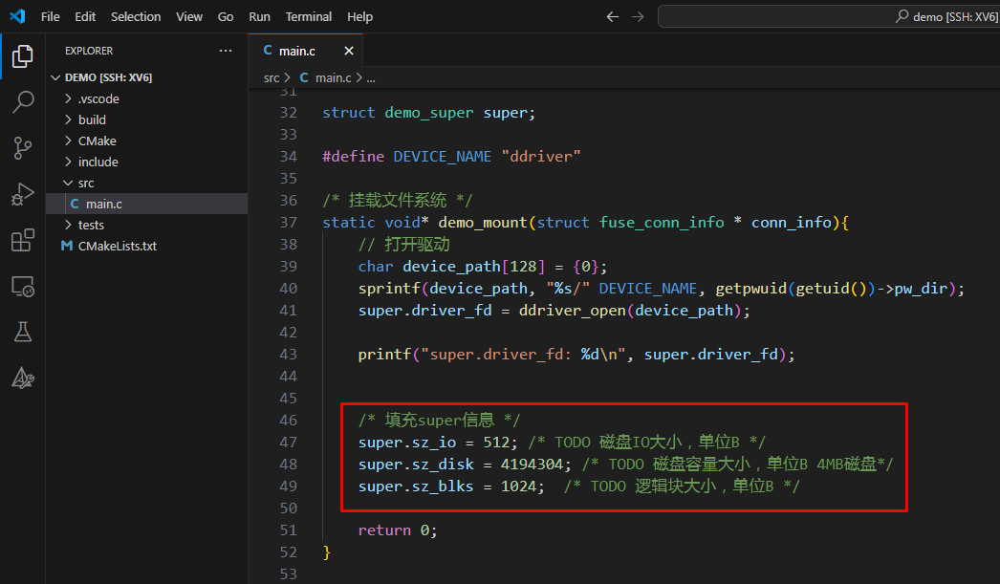
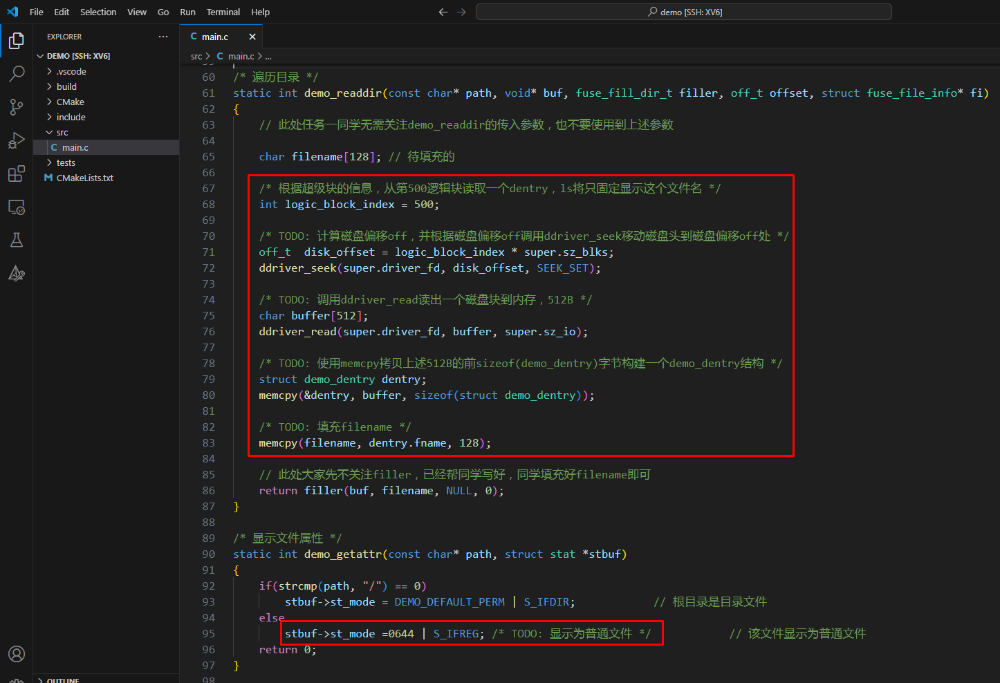
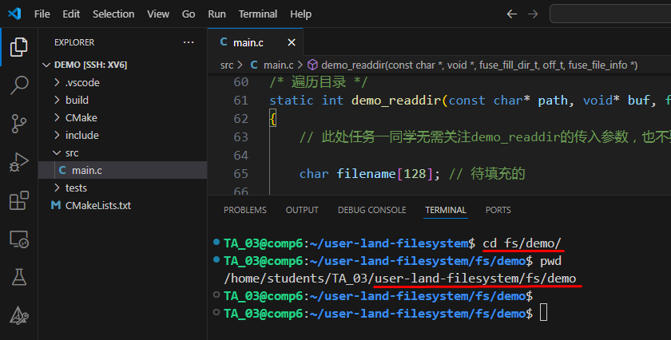
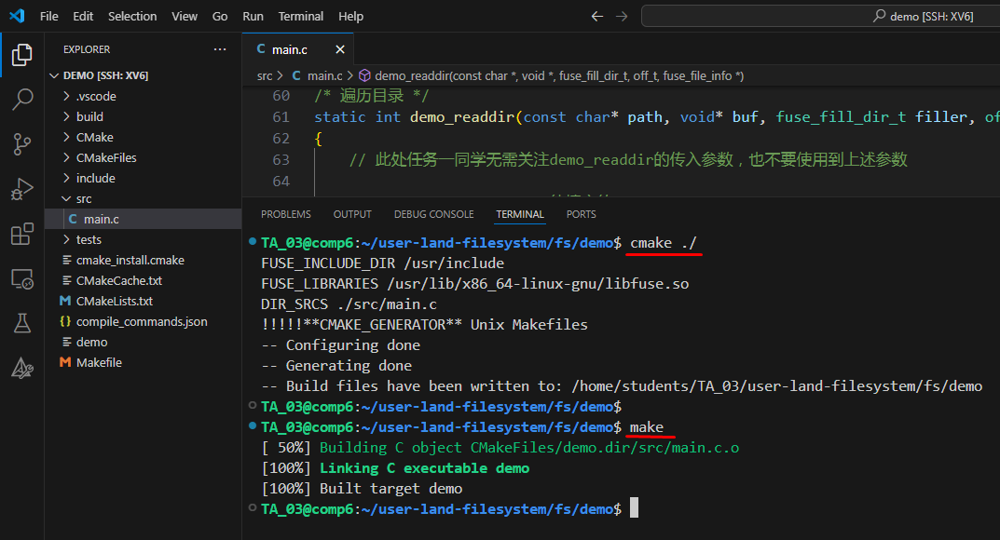
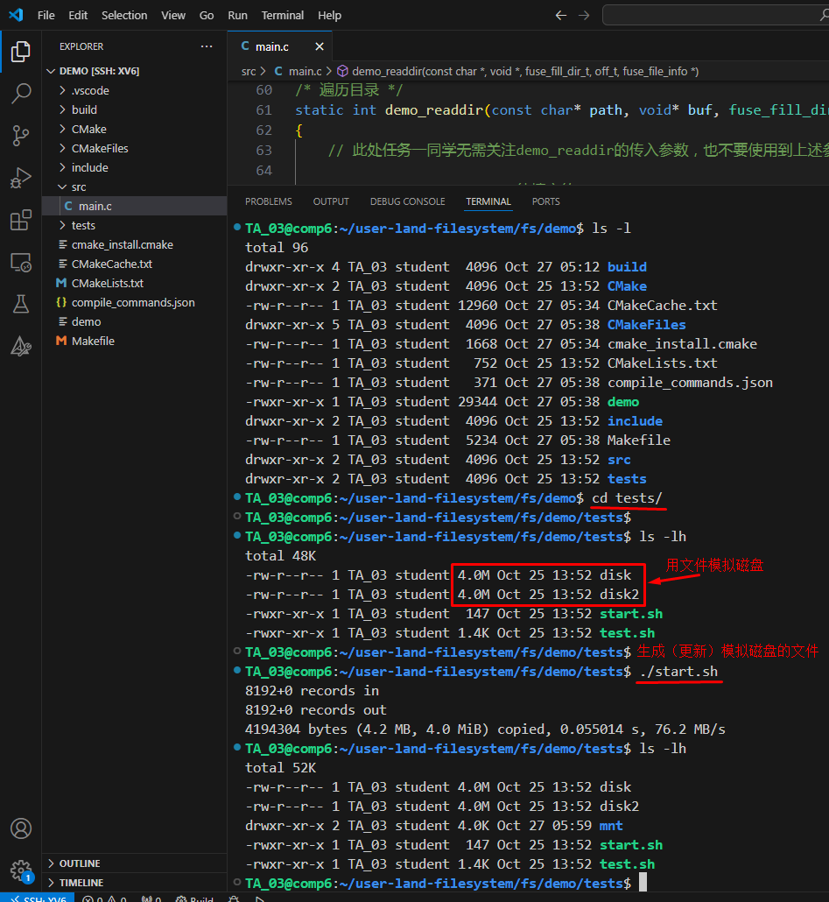
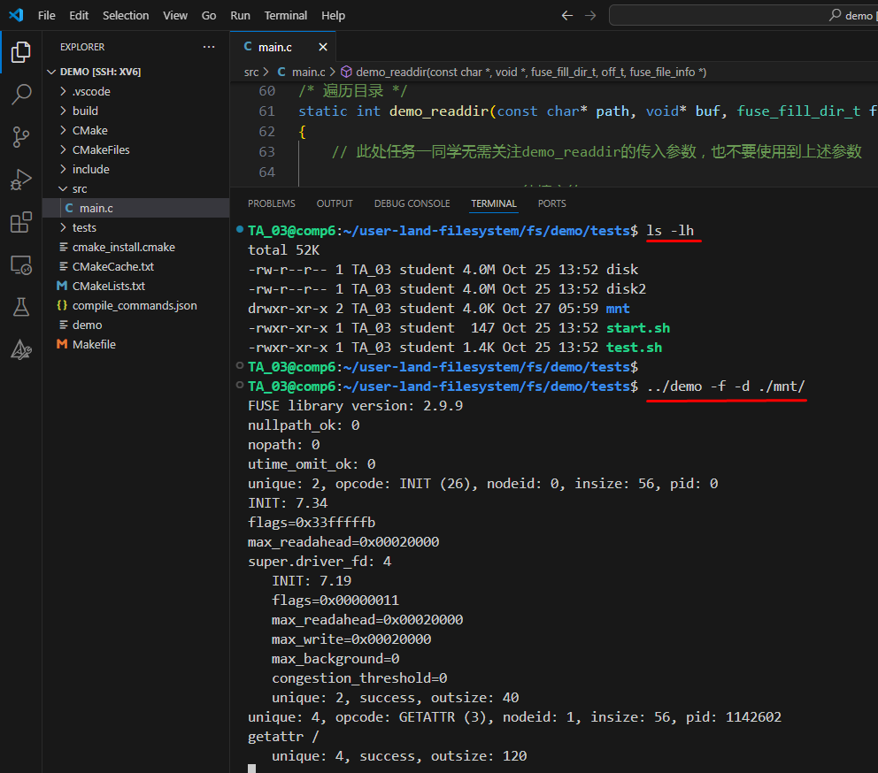
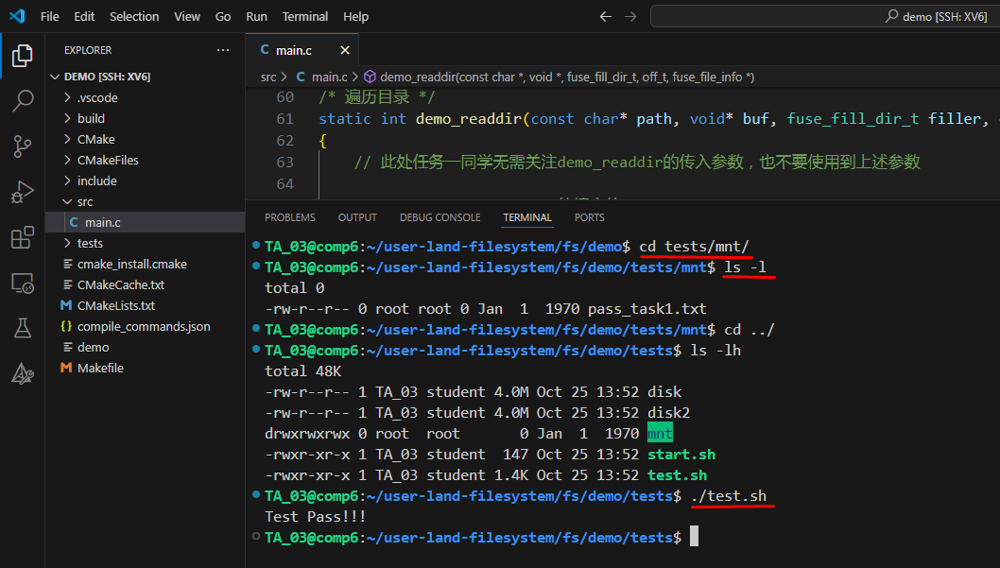

# 简单的文件系统demo


[点击这里--查看实验中心文档](https://os-labs.pages.dev/lab5/part3/#2-demo)


[点击这里--下载本章节代码](code.zip)


[点击这里--下载完整代码包](user-land-filesystem-demo.tar.bz2)


## 一、用VSCode打开 fs/demo 代码


本次实验的代码在 ```fs/demo``` 目录下，所以当你用 vscode 打开代码的时候，你也需要打开是的这个目录。**注意：**不是打开 ```fs```目录，而是```fs/demo```目录，不要弄错了。


## 二、文件系统挂载


[点击这里--查看文件修改](https://github.com/hitsz-ids/OS-Kernel-system-software-tutorial/commit/edede25467066da8c28c3985efe9f558bc59aa8c)


```c
    /* 填充super信息 */
    super.sz_io = 512; /* TODO 磁盘IO大小，单位B */
    super.sz_disk = 4194304; /* TODO 磁盘容量大小，单位B 4MB磁盘*/
    super.sz_blks = 1024;  /* TODO 逻辑块大小，单位B */
```





## 三、读取目录结构


[点击这里--查看文件修改](https://github.com/hitsz-ids/OS-Kernel-system-software-tutorial/commit/edede25467066da8c28c3985efe9f558bc59aa8c)


```c
/* 遍历目录 */
static int demo_readdir(const char* path, void* buf, fuse_fill_dir_t filler, off_t offset, struct fuse_file_info* fi)
{
    // 此处任务一同学无需关注demo_readdir的传入参数，也不要使用到上述参数

    char filename[128]; // 待填充的

    /* 根据超级块的信息，从第500逻辑块读取一个dentry，ls将只固定显示这个文件名 */
    int logic_block_index = 500;

    /* TODO: 计算磁盘偏移off，并根据磁盘偏移off调用ddriver_seek移动磁盘头到磁盘偏移off处 */
    off_t  disk_offset = logic_block_index * super.sz_blks;
    ddriver_seek(super.driver_fd, disk_offset, SEEK_SET);

    /* TODO: 调用ddriver_read读出一个磁盘块到内存，512B */    
    char buffer[512];
    ddriver_read(super.driver_fd, buffer, super.sz_io);

    /* TODO: 使用memcpy拷贝上述512B的前sizeof(demo_dentry)字节构建一个demo_dentry结构 */
    struct demo_dentry dentry;
    memcpy(&dentry, buffer, sizeof(struct demo_dentry));    

    /* TODO: 填充filename */
    memcpy(filename, dentry.fname, 128);

    // 此处大家先不关注filler，已经帮同学写好，同学填充好filename即可
    return filler(buf, filename, NULL, 0);
}

/* 显示文件属性 */
static int demo_getattr(const char* path, struct stat *stbuf)
{
    if(strcmp(path, "/") == 0)
        stbuf->st_mode = DEMO_DEFAULT_PERM | S_IFDIR;            // 根目录是目录文件
    else
        stbuf->st_mode =0644 | S_IFREG; /* TODO: 显示为普通文件 */            // 该文件显示为普通文件
    return 0;
}
```




## 四、编译程序


这个工程是用 CMake 来组织的，所以我们需要先用 CMake 生成 Makefile，然后才能编译，操作如下：

```shell
# 进入 demo 目录
cd fs/demo

```





用 CMake 生成工程编译文件

```
# 在 fs/demo 目录下，生成 Makefile 文件，这样后面才能进行编译操作
cmake ./ 

# 编译项目 生成 fuse 文件系统
make
```




## 五、测试文件系统


这个demo文件系统我们已经编译完成了，接下来我们需要测试文件系统是否正确。


1. ### 生成测试磁盘文件

   我们这里的文件系统是用一个 文件 来模拟一个磁盘，然后在这个文件里面建立文件系统。既然是用文件来模拟磁盘，那我们需要首先建立这样一个文件。

   在 ```fs/demo```目录下已经建立好了测试目录，里面有对应的测试文件，我们接下来操作：

   ```shell
   # 进入 tests 目录
   cd tests
   
   # 查看文件
   ls -lh
   
   # 生成（更新）模拟的磁盘文件
   ./start.sh
   
   # 注意：demo 默认写死了模拟磁盘的文件在 ~/ddriver 这个文件
   
   ```

   

   

2. ### 挂载Fuse文件系统

   我们开发的文件系统是 fuse 实现的系统，接下来我们用模拟文件挂载到一个目录下，测试文件系统是否正常工作。

   注意：demo 默认写死了模拟磁盘的文件在 ~/ddriver 这个文件

   

   ```shell
   # 注意：前面执行 start.sh 会在 tests 下自动建立一个目录 mnt，如果你没有这个目录说明你的 start.sh 没有执行
   # 挂载文件系统到 /mnt 目录
   ../demo -f -d ./mnt/
   
   # 注意：这个程序运行后不会退出，就一直这么显示着，你需要另外开一个独立的 Terminal 来进行后续的测试
   ```

   

   

3. ### 测试文件系统


文件系统已经被挂载到 ```fs/demo/tests/mnt```目录下了，接下来我们需要新开一个 Terminal 去查看这个目录是否有文件了。

```
# 进入 mnt 目录
cd tests/mnt

# 查看内容
ls -lh

# 运行测试脚本
cd ..
ls -lh
./test.sh

# 最后看到   Test Pass !!!  就算测试成功

```




