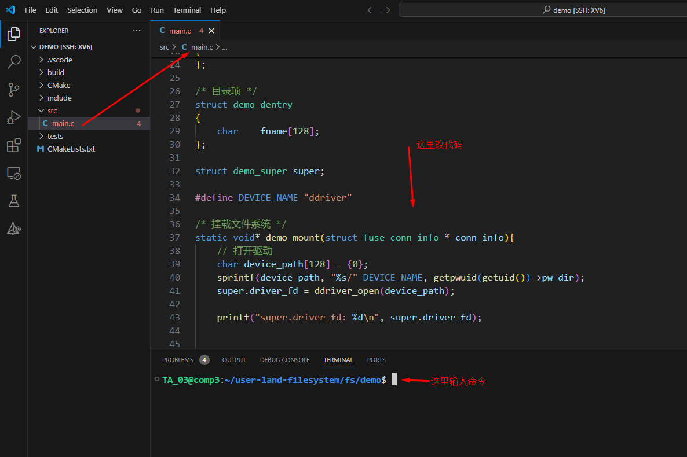

# 简单的文件系统demo


[点击这里--查看实验中心文档](https://os-labs.pages.dev/lab5/part3/#2-demo)


## 一、用VSCode打开 fs/demo 代码


本次实验的代码在 ```fs/demo``` 目录下，所以当你用 vscode 打开代码的时候，你也需要打开是的这个目录。**注意：**不是打开 ```fs```目录，而是```fs/demo```目录，不要弄错了。




