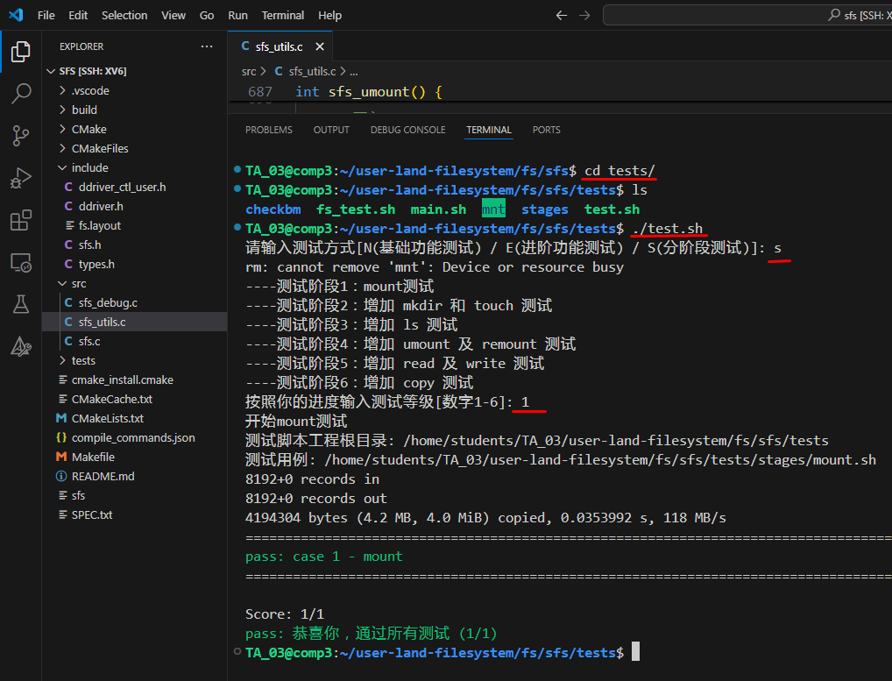

# 实现青春版EXT2文件系统


[点击这里--查看实验中心文档](https://os-labs.pages.dev/lab5/part3/#3-ext2)


[点击这里--下载本章代码](Code.zip)


[点击这里--下载完整代码](user-land-filesystem.tar.bz2)


## 一、建立工程

我们新建一个工程 ```sfs```（对，就用这个名字，因为这样我们就可以使用 simplefs 中的代码)

```shell
# 下载代码
git clone https://gitee.com/ftutorials/user-land-filesystem.git

# 进入代码目录
cd user-land-filesystem

# 生成工程 sfs （注意要输入两次）
./setenv.sh
```


## 二、从 simplefs 复制代码到 sfs

代码中提供了一个例子 ```simplefs```，这个例子已经实现了一个基本的文件系统，我们利用这个工程的代码来修改会更加方便。

```shell
# 进入 fs 目录
cd fs
# 查看目录下面的内容
ls

# 从 simplefs 复制 include 文件
cd sfs/include/
cp -f ../../simplefs/include/*.h ./
ls

# 从 simplefs 复制 src 文件
cd ../src
cp -f ../../simplefs/src/*.c ./
ls

# 编译 sfs 工程
cd ..
cmake ./
make

# 到这里，你应该可以正常编译整个工程
# 接下来，我们会在这个复制过来的代码基础上做修改，最终实现 Ext2 文件系统

```


## 三、用 VSCode 打开 sfs 代码


注意：我们打开的目录是 ```fs/sfs```，不要打开错了。其中 ```include/fs.layout```文件说明了磁盘结构，如下：

```
# Layout File
#  
# 以SFS为例, 其包含超级块、Inode位图以及数据区, 假设超级块占据1个块, 
# Inode位图占据15个块, 则Layout可表示为: 
# 
# | BSIZE = 512 B |
# | Super(1) | Inode Map(15) | DATA(*) |
# 
# 其中: 
# BSIZE => 逻辑块的大小
# Super => 超级块
# Inode Map => Inode位图
# DATA => 数据区, *代表剩下的区域都是数据区
# 
# 请在该文件中描述你的文件系统布局
# 注意:
# 0. BSIZE必须单独成行, 为了方便, 块大小按字节计数.
# 1. 我们已经针对该实验提供了一个简单示意框架, 你只需要修改()里的数据即可
# 2. 该布局文件用于检查你的文件系统是否符合要求, 请保证你的布局文件中的数据块数量与
#    实际的数据块数量一致.

| BSIZE = 1024 B |
| Super(1) | Inode Map(1) | DATA Map(1) | INODE(1) | DATA(*) |
```


## 四、修改 types.h 文件


[点击这里--查看代码修改](https://github.com/hitsz-ids/OS-Kernel-system-software-tutorial/commit/c493b934d640fe5f4b72562ade73139aaee35a8e)


在文件 ```include/types.h```中定义了所有的结构，我们需要做修改。

1. ### 增加逻辑块大小为 1024B

   ```c
   #define SFS_IO_SZ()                     (sfs_super.sz_io)
   #define SFS_BLK_SZ()                    (SFS_IO_SZ() * 2)
   
   // 我们需要修改 src/sfs_utils.c  src/sfs.c 中对 SFS_IO_SZ 的引用，修改为引用  SFS_BLK_SZ
   
   ```

   

   

2. ### 修改超级块（Super Block）结构

   

   [点击这里--查看代码修改](https://github.com/hitsz-ids/OS-Kernel-system-software-tutorial/commit/c493b934d640fe5f4b72562ade73139aaee35a8e)

   

   ```c
   /******************************************************************************
   *  这个是磁盘结构，和保存在磁盘上的数据一一对应
   *  在 sfs_mount 的时候从磁盘读取，然后加载到这里
   *  在 sfs_umount 的时候重新写回到磁盘
   *
   * SECTION: FS Specific Structure - Disk structure
   * | Super(1) | Inode Map(1) | DATA Map(1) | INODE(1) | DATA(*) |
   *******************************************************************************/
   struct sfs_super_d
   {
       uint32_t           magic_num;
       uint32_t           sz_usage;
       
       uint32_t           max_ino;
       // Inode Map(1) 
       uint32_t           map_inode_blks;
       uint32_t           map_inode_offset;
       // DATA Map(1) 
       uint32_t           map_data_blks;
       uint32_t           map_data_offset;    
       // INODE
       uint32_t           inode_offset;
       // DATA
       uint32_t           data_offset;
   };
   
   /** 这个是内存结构，方便平时操作，下面  struct sfs_super_d  是对应磁盘结构 
    * 
    * | Super(1) | Inode Map(1) | DATA Map(1) | INODE(1) | DATA(*) |
    * 
    *  在 sfs_mount 的时候从磁盘读取，然后加载到这里
    *  在 sfs_umount 的时候重新写回到磁盘
    * 
   */
   struct sfs_super
   {
       int                driver_fd;
       
       int                sz_io;
       int                sz_disk;
       int                sz_usage;
       
       int                max_ino;
   
       // Inode Map
       uint8_t*           map_inode;
       int                map_inode_blks;
       int                map_inode_offset;
       
       // Data Map
       uint8_t*           map_data;
       int                map_data_blks;
       int                map_data_offset;
       
       // Inode 
       int                inode_offset;
   
       // Data 
       int                data_offset;
   
       boolean            is_mounted;
   
       struct sfs_dentry* root_dentry;
   };
   ```

   


## 五、实现文件系统挂载（mount）


[点击这里--查看代码修改](https://github.com/hitsz-ids/OS-Kernel-system-software-tutorial/commit/c493b934d640fe5f4b72562ade73139aaee35a8e)


我们修改了超级块，在文件系统挂载的时候需要针对新的超级块做修改，修改文件 ```fs/sfs_utils.c```。

```c
// 关键代码

	if (sfs_super_d.magic_num != SFS_MAGIC_NUM) { 
        // 超级块，占1个块
        super_blks = 1;
        // Inode Map 占1个块
        map_inode_blks = 1;
        // Data Map 占1个块
        map_data_blks = 1;
        
        /* 布局layout */
        // 总的 inode 数量
        sfs_super_d.max_ino = SFS_BLKS_SZ(map_inode_blks)*8;
        // Inode Map
        sfs_super_d.map_inode_blks  = map_inode_blks;
        sfs_super_d.map_inode_offset = SFS_SUPER_OFS + SFS_BLKS_SZ(super_blks);
        // Data Map
        sfs_super_d.map_data_blks  = map_data_blks;
        sfs_super_d.map_data_offset = sfs_super_d.map_inode_offset + SFS_BLKS_SZ(map_inode_blks);
        // Inode Offset
        sfs_super_d.inode_offset = sfs_super_d.map_data_offset +  SFS_BLKS_SZ(map_data_blks);
        // Data Offset
        sfs_super_d.data_offset = sfs_super_d.inode_offset + SFS_BLKS_SZ(sfs_super_d.max_ino);
        
        sfs_super_d.sz_usage    = 0;        

        // 标记这个磁盘是第一次使用
        is_init = TRUE;
    }

    sfs_super.max_ino = sfs_super_d.max_ino;
    sfs_super.sz_usage   = sfs_super_d.sz_usage;      /* 建立 in-memory 结构 */
            
    // 读取 Inode Map
    sfs_super.map_inode_blks = sfs_super_d.map_inode_blks;
    sfs_super.map_inode_offset = sfs_super_d.map_inode_offset;
    sfs_super.map_inode = (uint8_t *)malloc(SFS_BLKS_SZ(sfs_super.map_inode_blks));
    if (TRUE == is_init){  // 磁盘第一次使用，我们把 Inode Map 清零
        SFS_DBG("map_inode Init 0\n");
        memset(sfs_super.map_inode, 0, SFS_BLKS_SZ(sfs_super.map_inode_blks));
    }else{ // 不是第一次使用，我们从磁盘读取之前保存的数据
        SFS_DBG("map_inode Read From Disk\n");
        if (sfs_driver_read(sfs_super.map_inode_offset, (uint8_t *)(sfs_super.map_inode), 
                                SFS_BLKS_SZ(sfs_super.map_inode_blks)) != SFS_ERROR_NONE) {
                return -SFS_ERROR_IO;
            }
    }
    
    // 读取 Data Map
    sfs_super.map_data_blks = sfs_super_d.map_data_blks;
    sfs_super.map_data_offset = sfs_super_d.map_data_offset;
    sfs_super.map_data = (uint8_t *)malloc(SFS_BLKS_SZ(sfs_super.map_data_blks));
    if (TRUE == is_init){  // 磁盘第一次使用，我们把 Data Map 清零
        SFS_DBG("map_data Init 0\n");
        memset(sfs_super.map_data, 0, SFS_BLKS_SZ(sfs_super.map_data_blks));
    }else{ // 不是第一次使用，我们从磁盘读取之前保存的数据
        SFS_DBG("map_data Read From Disk\n");
        if (sfs_driver_read(sfs_super.map_data_offset, (uint8_t *)(sfs_super.map_data), 
                                SFS_BLKS_SZ(sfs_super.map_data_blks)) != SFS_ERROR_NONE) {
                return -SFS_ERROR_IO;
            }
    }

```


## 六、实现文件系统卸载（umount）


文件系统卸载的时候，我们需要把 Inode Map，Data Map 写入到磁盘，方便下次从磁盘读取数据。

```c
// 关键代码

    // 写入 Super Block                                                     
    sfs_super_d.magic_num          = SFS_MAGIC_NUM;
    sfs_super_d.sz_usage           = sfs_super.sz_usage;
    sfs_super_d.max_ino            = sfs_super.max_ino;
    sfs_super_d.map_inode_blks     = sfs_super.map_inode_blks;
    sfs_super_d.map_inode_offset   = sfs_super.map_inode_offset;
    sfs_super_d.map_data_blks      = sfs_super.map_data_blks;
    sfs_super_d.map_data_offset    = sfs_super.map_data_offset;
    sfs_super_d.inode_offset       = sfs_super.inode_offset;
    sfs_super_d.data_offset        = sfs_super.data_offset;
    
    SFS_DBG("umount write super block\n");
    if (sfs_driver_write(SFS_SUPER_OFS, (uint8_t *)&sfs_super_d, 
                     sizeof(struct sfs_super_d)) != SFS_ERROR_NONE) {
        return -SFS_ERROR_IO;
    }

    // 写入 Inode Map
    SFS_DBG("umount write inode map\n");
    if (sfs_driver_write(sfs_super_d.map_inode_offset, (uint8_t *)(sfs_super.map_inode), 
                         SFS_BLKS_SZ(sfs_super_d.map_inode_blks)) != SFS_ERROR_NONE) {
        return -SFS_ERROR_IO;
    }
    free(sfs_super.map_inode);

    // 写入 Data Map 
    SFS_DBG("umount write data map\n");
    if (sfs_driver_write(sfs_super_d.map_data_offset, (uint8_t *)(sfs_super.map_data), 
                         SFS_BLKS_SZ(sfs_super_d.map_data_blks)) != SFS_ERROR_NONE) {
        return -SFS_ERROR_IO;
    }    
    free(sfs_super.map_data);

```


## 七、文件系统挂载测试


```shell
# 编译文件系统
make

# 生成一个空磁盘
ddriver -r

# 挂载文件系统
./sfs -f -d tests/mnt
```


```shell
# 前面的挂载文件系统程序不会退出，所以你没法操作了
# 你需要新开一个 Shell 用于测试

# 进入 tests 文件夹
cd tests
ls

# 单独进行 mount 测试
./test.sh
# 输入 S 分阶段测试
# 输入 1 mount 测试

```





