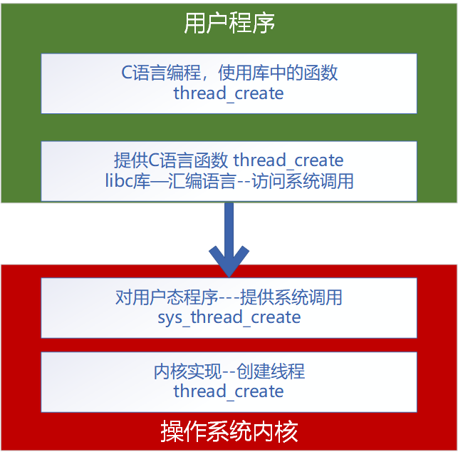

# 扩展实验：给XV6增加多线程支持


仿照Linux内核中对线程的实现方式，即：用task_struct的结构体来管理进程，task_struct中保存了一个进程的所有信息，包括内存地址空间、打开的文件、调度优先级、运行状态、上下文信息等；**Linux没有为支持线程而新增任何数据结构**，也就是说Linux中的进程和线程都是用task_struct这个结构体来表示；在Linux看来线程就是一个普通的进程，只不过这个进程和其它进程**共享了地址空间等资源**，所有共享同一个地址空间的task_struct组成了我们常说的进程，每个task_struct可以理解为我们常说的线程。

我们仿照 Linux 的实现，让 XV6 的内核支持 **“共享资源” 的进程，也就是 线程**。

这个多线程实现是在 XV6 的 util 分支代码上实现的，注意确认是是否用的是这个分支的代码。


[点击这里下载--本章节修改过的代码](XV6.zip)

[点击这里下载--完整多线程XV6系统代码（包括整个 XV6 + 我们修改过的代码）](xv6-full.tar.bz2)


## 一、系统架构


给操作系统**增加多线程**功能，并且还**需要让用户态程序可以使用**，是一个比较复杂的过程。下面是整个系统需要做的工作：




系统从下到上分为四层，我们依次从下到上实现。

**注意**：里面很多层函数名字相同，比如内核实现函数名为 thread_create，用户态提供C语言函数 thread_create，虽然函数名是一样，实际上**他们是完全不同的东西**。只是**为了方便**，我们**用了一模一样的名字而已**。所以，不同层是完全不同的实现，名字只是图方便用了一样，仅此而已。


接下来我们从底层内核开始，依次实现多线程功能。


## 二、修改内核进程管理结构，支持进程共享资源


内核进程管理结构在 **kernel/proc.h** 中定义：

[点击这里查看--代码修改](https://github.com/hitsz-ids/tutorial/commit/20e7a81d735379c05e70166a813b30ba125e1421#diff-9217aa6c10ce4a80f68f3d335a5aac4ffa587639b1e5053becbdf60db11bc9f1)

```
# 主要增加了这一行代码，用于标明当前 进程  是否为 线程

int is_thread;               // Flag to indicate whether this is a thread or process

```

[点击这里查看--原始代码](https://github.com/hitsz-ids/tutorial/blob/54228d7771fccad72096110d3d3f394c1c8e96fa/Chapter08/XV6/kernel/proc.h) 

[点击这里查看--修改后的代码](https://github.com/hitsz-ids/tutorial/blob/20e7a81d735379c05e70166a813b30ba125e1421/Chapter08/XV6/kernel/proc.h)


## 三、内核增加 线程创建、线程退出、线程等待  功能


内核进程操作在 **kernel/proc.c** 中，我们增加三个方法：


[点击这里查看--代码修改](https://github.com/hitsz-ids/tutorial/commit/91f1d6429a1a686dad672b1e862e5a4666dfd2d2)

```
// 线程创建
int  thread_create(void (*start_routine)(void*), void *arg, void *stack)

// 线程退出
void thread_exit(void)

// 线程等待
int  thread_join(int pid)

```

[点击这里查看--原始代码](https://github.com/hitsz-ids/tutorial/blob/a44f6570c99d97a9e1fb12d50d7750a465678962/Chapter08/XV6/kernel/proc.c)

[点击这里查看--修改后的代码](https://github.com/hitsz-ids/tutorial/blob/91f1d6429a1a686dad672b1e862e5a4666dfd2d2/Chapter08/XV6/kernel/proc.c)


## 四、把线程功能封装为 系统调用 


操作系统的 **内核态**、**用户态** 是严格分离的，**用户程序不能访问内核功能 ** （如果强行访问内核地址，程序就会被杀掉，就是大家平时见到的，程序访问地址非法，系统已经结束程序运行，或者在 Linux 中称为 Segment Fault ）。所以我们前面增加的内核功能 thread_create、thread_exit、thread_join 只能被内核自己调用，无法提供给用户程序使用。


要让内核功能被用户程序使用，唯一的方法就是把内核功能 **封装成系统调用** 提供给普通用户使用。类似我们常见的 读写文件 fread，fwrite 一样，这都是系统调用。**接下来，我们把内核功能封装为系统调用**。


### （1）在 **kernel/syscall.h** 中定义三个新的系统调用


[点击这里查看--代码修改](https://github.com/hitsz-ids/tutorial/commit/69b53990c887887b41a69a3d63eccd63336970dc)

```
#define SYS_thread_create 22
#define SYS_thread_exit   23
#define SYS_thread_join   24
```

[点击这里查看--原始代码](https://github.com/hitsz-ids/tutorial/blob/952aed940b1992878db44c7b3f8f0baf98b130a9/Chapter08/XV6/kernel/syscall.h)

[点击这里查看--修改后的代码](https://github.com/hitsz-ids/tutorial/blob/69b53990c887887b41a69a3d63eccd63336970dc/Chapter08/XV6/kernel/syscall.h)


### （2）在 **kernel/defs.h** 中加入之前定义的三个函数，为了后面的调用


[点击这里查看--代码修改](https://github.com/hitsz-ids/tutorial/commit/b2c0325d6ef55fb6372fe8409abd35e5a9fff29b)

```
int             thread_create(void (*start_routine)(void*), void *arg, void *stack);
void            thread_exit(void);
int             thread_join(int pid, uint64 addr);
```


[点击这里查看--原始代码](https://github.com/hitsz-ids/tutorial/blob/48d0fe8f33fefa766d95811034860427acdd516e/Chapter08/XV6/kernel/defs.h)

[点击这里查看--修改后的代码](https://github.com/hitsz-ids/tutorial/blob/b2c0325d6ef55fb6372fe8409abd35e5a9fff29b/Chapter08/XV6/kernel/defs.h)


### （3）在 **kernel/sysproc.c** 中实现系统调用，调用内核 thread_xxx 功能


[点击这里查看--代码修改](https://github.com/hitsz-ids/tutorial/commit/bccae776c5446e245e90bbe5a220ddd1b4c8051b)


[点击这里查看--原始代码](https://github.com/hitsz-ids/tutorial/blob/1c37ef63c6dab6c40f91a22fbdee5abfa1cf55d5/Chapter08/XV6/kernel/sysproc.c)

[点击这里查看--修改后的代码](https://github.com/hitsz-ids/tutorial/blob/bccae776c5446e245e90bbe5a220ddd1b4c8051b/Chapter08/XV6/kernel/sysproc.c)


### （4）在 **kernel/syscall.c** 中导出系统调用 符号表：


系统调用提供给用户态程序运行，是通过提供一批 “**符号表**” 来实现的。所谓 “符号表” ， 就是系统调用的 **“函数名” --> "函数地址" 的对应**。用户态程序通过查找符号表中 **sys_thread_create** 名字，得到这个导出**函数的地址**，然后**访问这个地址实现对系统调用的访问**。


[点击这里查看--代码修改](https://github.com/hitsz-ids/tutorial/commit/2a649c95419b073ddf7b6e5b13fd74f265c9f358)


[点击这里查看--原始代码](https://github.com/hitsz-ids/tutorial/blob/952aed940b1992878db44c7b3f8f0baf98b130a9/Chapter08/XV6/kernel/syscall.c)

[点击这里查看--修改后的代码](https://github.com/hitsz-ids/tutorial/blob/2a649c95419b073ddf7b6e5b13fd74f265c9f358/Chapter08/XV6/kernel/syscall.c)


### （5）测试内核编译，确保内核编译正确


到现在为止，我们已经完成了  在内核中添加多线程支持，以及提供线程的系统调用给用户程序。现在我们再次编译 XV6 内核，确认之前添加的功能没有出错。

```
# 编译内核，确认之前添加的代码没有问题

make qemu

```


## 五、用户态程序库支持新的 系统调用 

理论上，你的用户态程序可以直接访问 **系统调用**， 是的，只是 “**理论上**” 。


实际上，99% 的程序，都是通过 **程序库** 来访问系统调用的。大家平时用的 printf、malloc、read、write、... 都是被 libc 库封装好的函数，由 libc 库去访问系统调用，所以**你的程序实际上根本没有直接访问过任何 系统调用**。


我们这里也延续这个 习俗，**把系统调用封装在 用户态的程序库中**，而你的用户程序只是调用 用户态程序库。


### （1）用户态 汇编语言，访问系统调用地址

你没看错，就是 “汇编语言” ， 这就是为什么你的程序从来没有直接访问系统调用的原因，除非你愿意自己用汇编语言去写接口。所以，这些系统调用都是 程序库 用汇编写好，然后你只需要调用 程序库 就可以了。

修改 **user/usys.pl** 文件，加入新的系统调用，这个文件会负责生成对应的 汇编代码。


[点击这里查看--代码修改](https://github.com/hitsz-ids/tutorial/commit/6f5281da06c6672ab3307da83f7ea9648a0a62db)

[点击这里查看--生成的汇编代码](https://github.com/hitsz-ids/tutorial/blob/6f5281da06c6672ab3307da83f7ea9648a0a62db/Chapter08/XV6/user/usys.S)


[点击这里查看--原始代码](https://github.com/hitsz-ids/tutorial/blob/cd012734ab957440ebad8253ffad61a56fb43e3f/Chapter08/XV6/user/usys.pl)

[点击这里查看--修改后的代码](https://github.com/hitsz-ids/tutorial/blob/6f5281da06c6672ab3307da83f7ea9648a0a62db/Chapter08/XV6/user/usys.pl)


### （2）用户态 提供 C语言接口

通过汇编访问系统调用，然后提供一个 C语言 接口，方便你的 C语言程序 可以使用。你平时用的 printf、malloc、read、write 全是 C语言接口。


修改 **user/user.h** 文件，加入 C语言接口 定义


[点击这里查看--代码修改](https://github.com/hitsz-ids/tutorial/commit/e483f1cf6dac98f243386641b704b8ef1712f25f)


[点击这里查看--原始代码](https://github.com/hitsz-ids/tutorial/blob/fc3dea82c1d27ca3f1fe565ccbde0c472c6347f0/Chapter08/XV6/user/user.h)

[点击这里查看--修改后的代码](https://github.com/hitsz-ids/tutorial/blob/e483f1cf6dac98f243386641b704b8ef1712f25f/Chapter08/XV6/user/user.h)


## 六、写一个用户程序来调用 线程操作


### （1）写一个 **user/threadtest.c** 程序用来测试多线程的功能是否正确。

**注意**：这是一个用户态的程序，所以我们需要**把它放在  user 目录下**，参考之前的教程  [XV6与Unix实用程序Sleep实验](../Chapter03/Chapter03.md)


 [点击查看：user/threadtest.c 程序](XV6/user/threadtest.c)


### （2）把 threadtest.c 加入 Makefile 编译 


[点击查看--Makefile代码](XV6/Makefile)


### （3）编译 XV6内核 + 用户态程序


```
# 编译 内核 + 用户态 程序
make qemu 
```


### （4）运行多线程程序 

```
# 运行多线程程序
threadtest

```


## 七、多线程实现说明


### （1）共享内存实现 

真正的多线程，应该是共享内存的。10个线程，共享同一个进程的内存空间。但是，**我们目前没有实现共享内存**。

没实现的原因：

- 多个线程共享内存，每个线程退出都会 “释放内存” ，这时候需要对内存做使用**计数**，释放其实是**减计数**，等**计数为零**的时候，才真正的释放内存。
- XV6 内存管理没有实现 “计数”。他每个进程都复制所有内存，这样每个进程释放内存都是释放自己的，不需要计数。
- 如果要实现共享内存，就需要我们大幅修改内存代码，自己实现引用计数，包括共享页表、共享文件都要计数，工作量太大了。


### （2）各种资源共享实现 

各种资源都需要实现 “**计数**” 共享。比如进程中10个线程打开了同一个文件，现在一个线程关闭文件，我们需要 “**减计数**” ，直到所有线程关闭文件 **计数为零**，我们才真的关闭文件。Linux 系统万物皆文件，包括 普通文件、管道 Pipe、设备文件 Dev、显示输出、Socket、... 都需要实现一套 “**计数**” 机制，才能做到真正的 **多线程共享资源** 。


### （3）设备访问互斥  

多个线程同时访问设备，比如打印输出到屏幕，需要实现 **设备锁**、**互斥访问**。不然就会几个线程打印的内容相互穿插。如下

线程1 ： printf("AAAAAAA")

线程2：  printf("BBBBBBB")

正常多线程打印结果应该是

```
AAAAAAA
BBBBBBB
```

目前多线程**没有实现** **设备锁**，**互斥访问**，所以多线程同时运行，打印会出现如下情况：

```
AABABBBBAABBBA          两个线程打印的东西相互穿插，混在一起了，这是因为没有实现  设备锁、互斥访问
```


很多资源都需要实现相应的 设备锁、互斥访问。


### （4）父进程等待多个子进程

一个程序生成几十个线程，一般都会需要有一个功能，一次等所有线程结束再退出，如下：

```
// 生成 20个线程
for(int i=0; i < 20; i++)
    thread_create(....)
    
// 等待所有线程退出
wait_for_all()

```

目前我们没有这个功能，我们只能一个一个等线程退出，没法批量等


### （5）总结

XV6 是一个教学系统，为了保证它的小巧可读，很多现代操作系统的功能并没有实现。如果需要实现真正意义上的多线程，需要大幅修改整个系统的代码。这个工作就留给大家自己练手了。